# Design and Deployment of Secure Azure SQL PaaS with Cross-Region High Availability 

## 🔴 Problem Overview

In banking and fintech payment systems, a database outage is not just a technical incident; it is a

- business interruption,
- a security concern,
- and a trust problem.

 A single-region SQL deployment with public access and manual recovery introduces three serious risks:
 
| Risk                | Description          | Business Impact             |
| ------------------- | -------------------- | --------------------------- |
| Downtime            | No high availability | Transactions stop           |
| Exposure            | Public endpoints     | Increased attack surface    |
| Operational Failure | Manual recovery      | Slow + error-prone recovery |

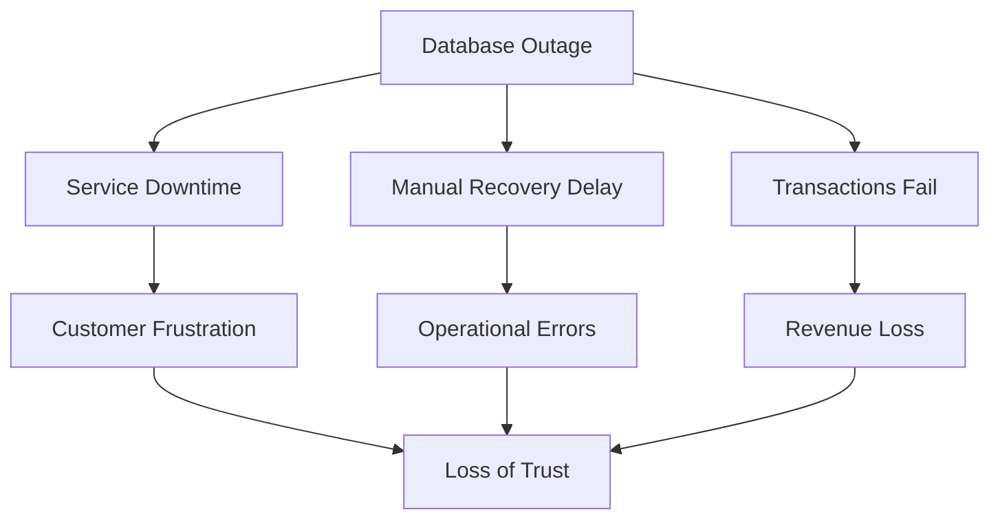

## 🎯 Engineering Objective

Design and Deploy a secure, highly available Azure SQL platform that:

- meets RTO (15–30 min) and RPO (≤ 5 min) targets
- eliminates public exposure through private connectivity
- enables automated, cross-region failover

| Problem      | Solution               | Azure Feature     |
| ------------ | ---------------------- | ----------------- |
| Downtime     | Automatic failover     | Failover Groups   |
| Data Loss    | Continuous replication | Geo-replication   |
| Exposure     | Private access only    | Private Endpoints |
| Key Security | Encryption control     | Key Vault         |

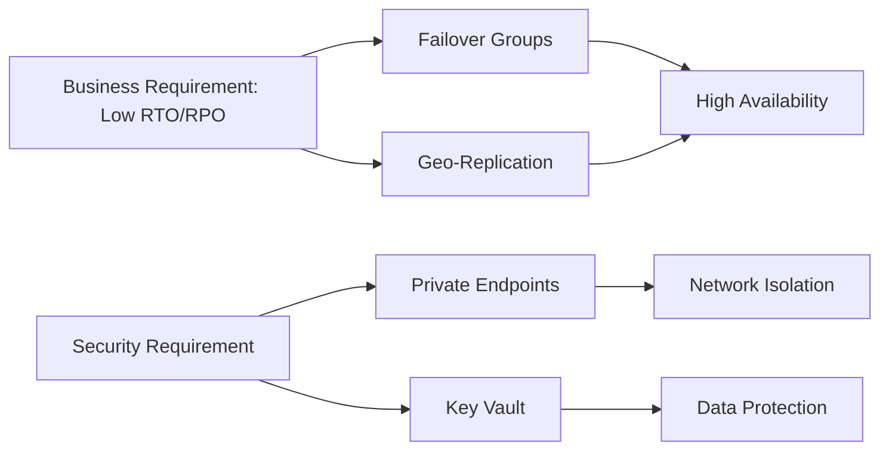

## User Impact

This diagram shows how key engineering decisions translate into measurable user and business outcomes.

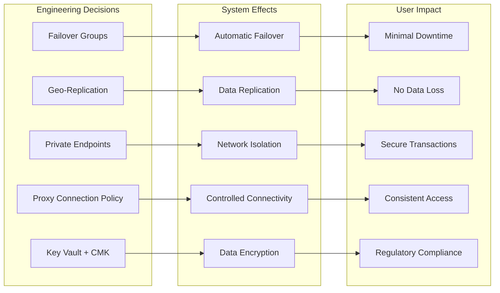

## 🏗️ System Architecture

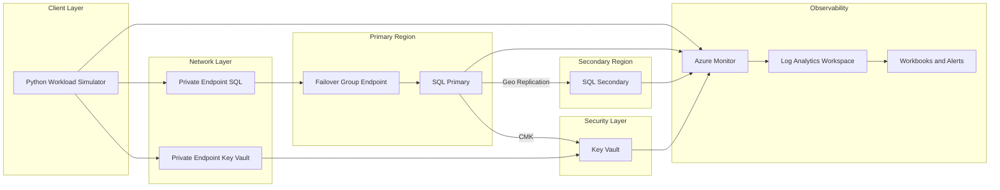

## 🌍 Region Selection (RPO/RTO Driven)

| Role             | Region         |
|------------------|---------------|
| Primary          | Central India |
| Secondary        | South India   |

**Trade-off Consideration**

| Option                          | Impact                              |
|---------------------------------|-------------------------------------|
| Nearby regions (chosen)         | Better RPO, faster RTO              |
| Distant regions (e.g., India → Europe) | Higher latency → worse RPO |

##  🔌 Connection Policy Selection

| Policy   | Connectivity Model                  | Network Requirement              | Performance | Suitability for Banking Environment |
|----------|------------------------------------|----------------------------------|------------|-------------------------------------|
| Proxy ✅ | Gateway-only (port 1433)           | Minimal (single port)            | Lower      | ✅ Best fit (controlled, compliant)  |
| Redirect | Direct to database node            | Requires ports 11000–11999 open  | High       | ❌ Not suitable (breaks lockdown)    |
| Default  | Redirect → Proxy fallback          | Depends on environment           | Variable   | ⚠️ Unpredictable behavior           |

---

**Decision:**  
Proxy was intentionally selected to enforce **strict network control and deterministic connectivity**, ensuring alignment with real-world banking security constraints where dynamic port access is restricted.

## 🧪 Replication Strategy (Failover Groups / Geo-Replication)

This architecture intentionally combines Failover Groups and Active Geo-Replication within the same Azure SQL environment to evaluate their operational behavior and recovery characteristics.

The environment provisions 20 databases:

- 10 databases use Failover Groups for automated failover and managed replication  
- 10 databases use Active Geo-Replication with manually managed secondary databases  

This design enables direct comparison of failover behavior, recovery time, and operational complexity across both models.

## 🔐 Security and Encryption (Key Vault + CMK)

To meet security and compliance requirements, the architecture implements Transparent Data Encryption (TDE) using Customer-Managed Keys (CMK) stored in Azure Key Vault.

### Key Components

| Component | Role |
|----------|------|
| Azure SQL Server | Encrypts data at rest |
| Managed Identity | Authenticates SQL Server to Key Vault |
| Key Vault | Secure storage for encryption keys |
| Customer-Managed Key (CMK) | Used for TDE encryption |

---

### 🔑 Encryption Flow

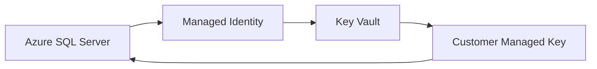

#### 🔐 Security Controls

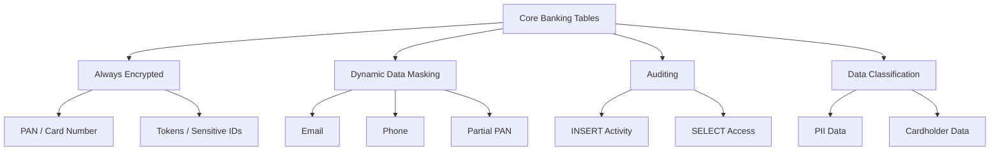

## SQL Server Auditing

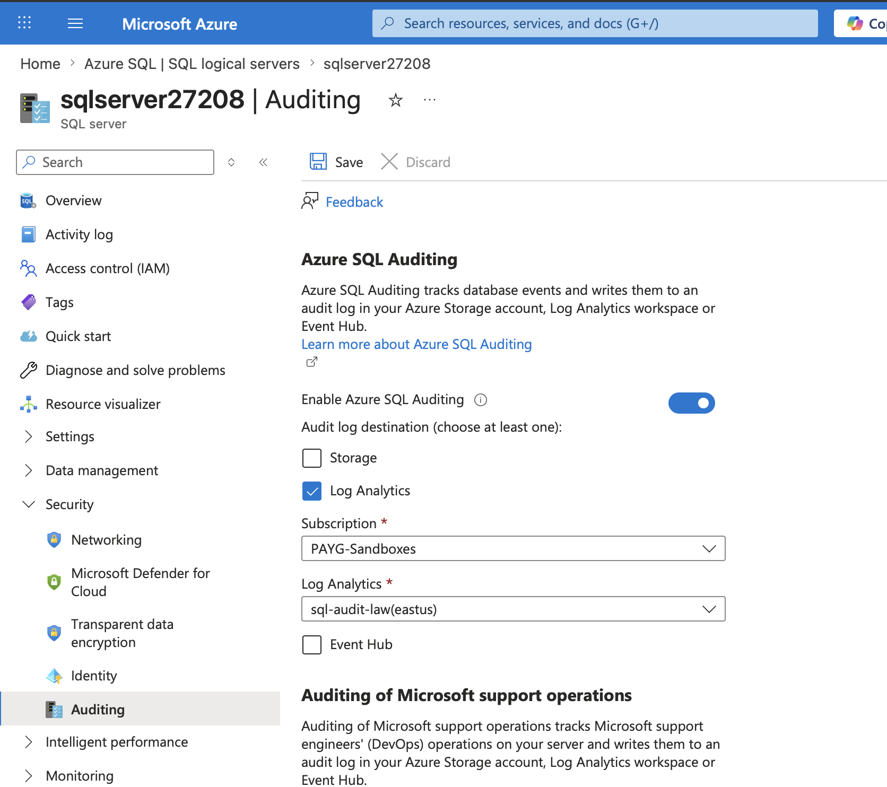

---

## Audit Logs Verification

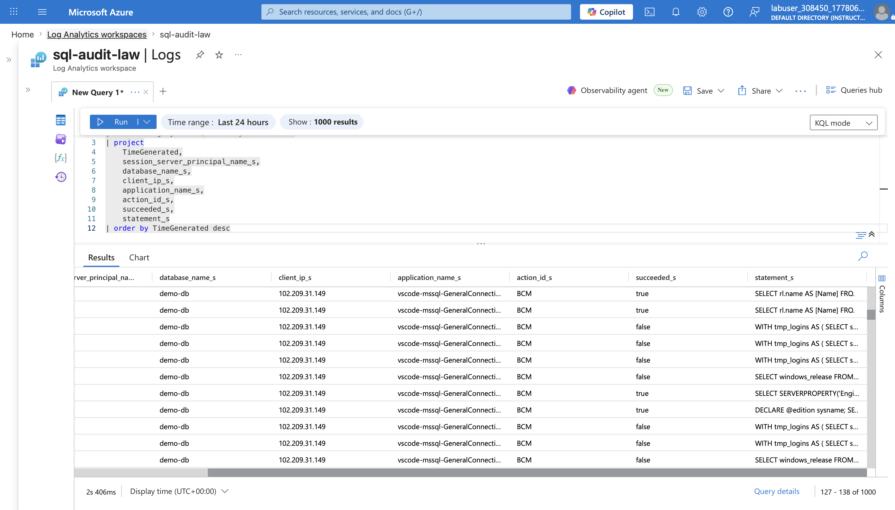

## Diagnostic Settings

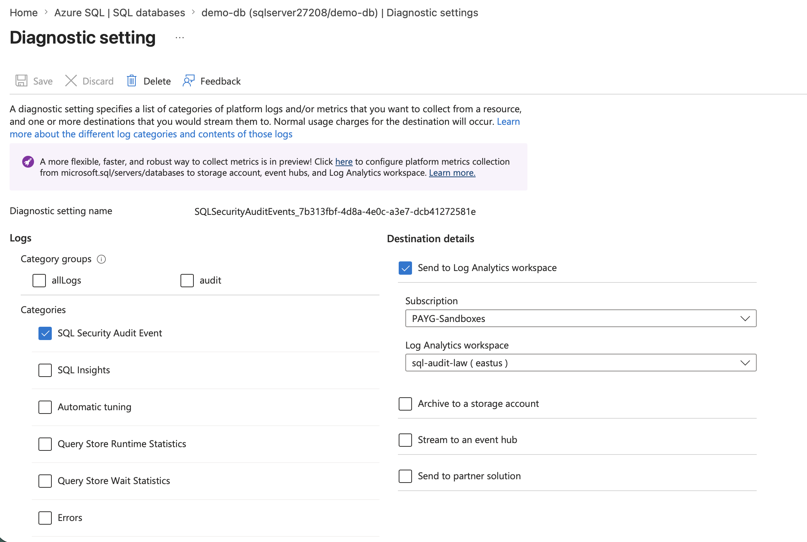

---

## Data Classification

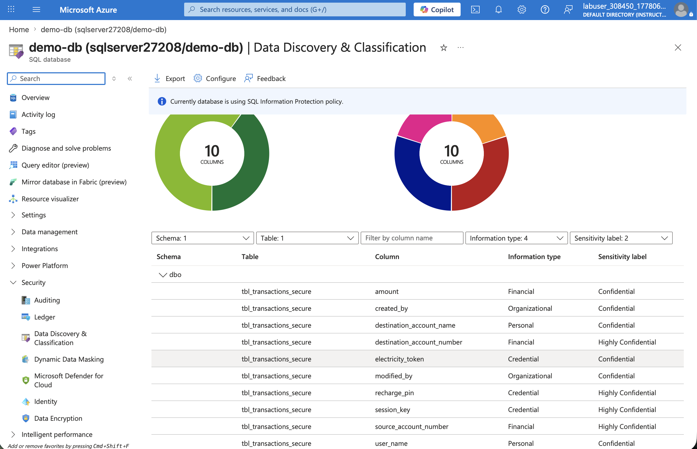

---

## Dynamic Data Masking Demonstration

Dynamic Data Masking (DDM) was applied to sensitive financial and identity-related columns to reduce unnecessary exposure of sensitive data to non-privileged users.

### Regular User View

The regular contained database user (`db_datareader`) can query the table, but masked columns such as account numbers, usernames, and operational secrets remain partially or fully obfuscated.

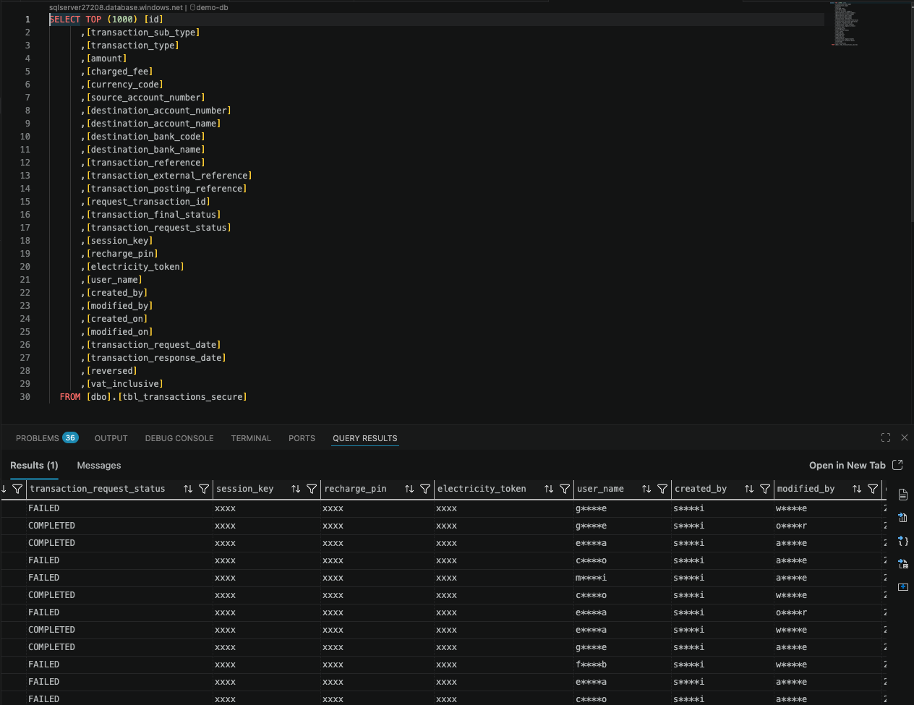

---

### Admin User View

Administrative users such as the Microsoft Entra administrator can view original unmasked values.

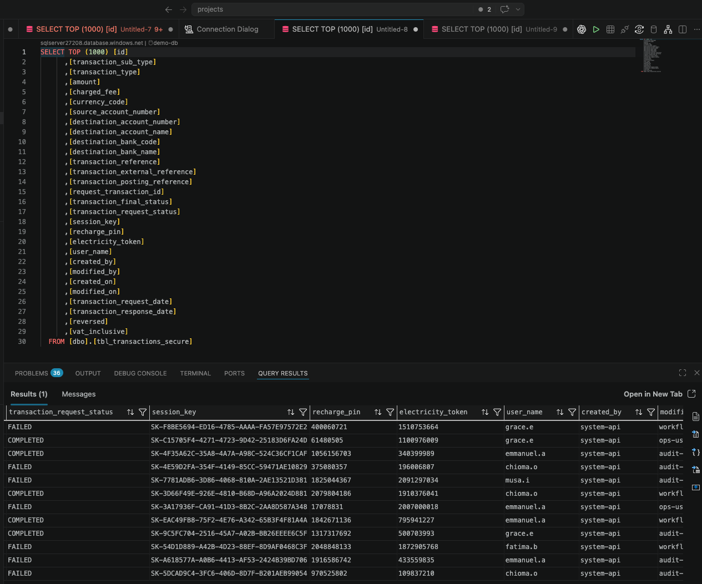

### Always Encrypted

This confirms that Azure SQL Always Encrypted was successfully configured by creating the Column Master Key (CMK) metadata, generating and protecting the Column Encryption Key (CEK) using Azure Key Vault through the PowerShell client, encrypting sensitive transaction columns with deterministic and randomized encryption types, and validating that protected data remains unreadable when queried directly without client-side decryption access.

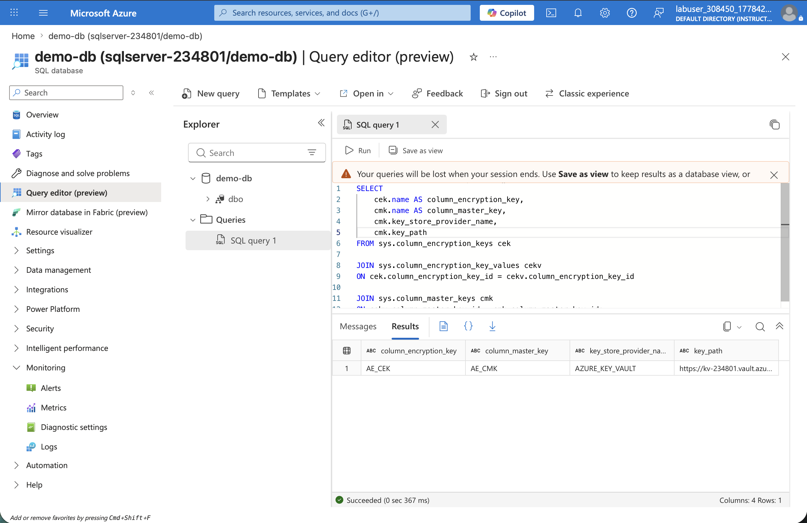

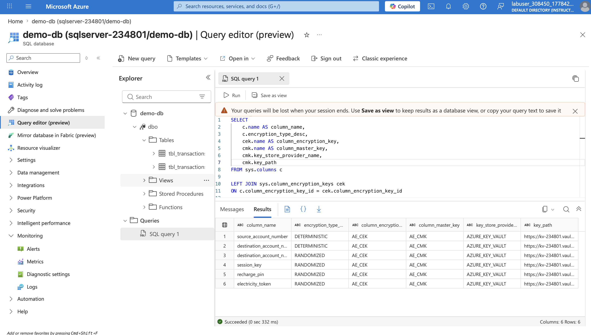

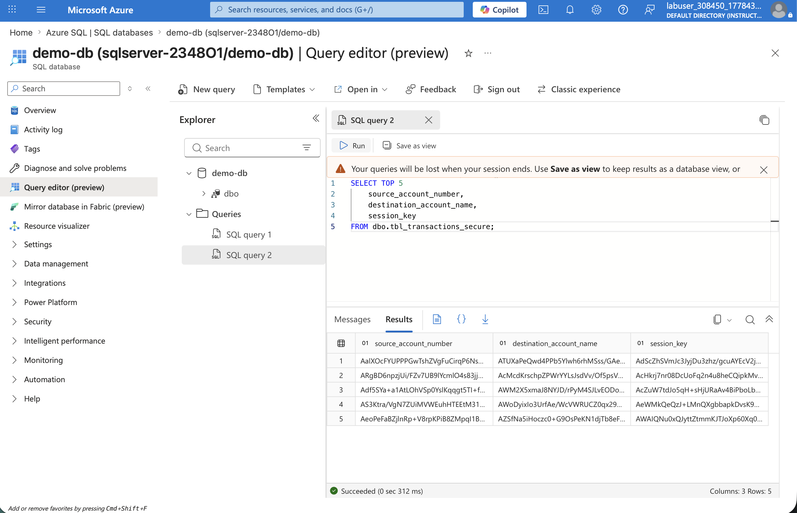

## Workload Simulation and Validation

This phase introduces a Python-based workload simulator to validate how the Azure SQL architecture behaves under realistic operational conditions.

Ansible will be used to automate the deployment process by configuring the Azure VM, installing required drivers and dependencies, and deploying the Python workload scripts automatically.

The workload simulator will then execute realistic database activities such as:

* Batch inserts for high-volume transaction ingestion
* Concurrent database operations to simulate multiple workloads
* Large updates and deletes to test transaction log and IO behavior

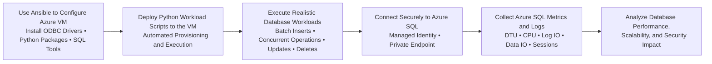

<h2>Playbooks and Automation Files</h2>

<ul>
  <li><a href="./ansible/playbooks/">Ansible Playbooks Directory</a></li>
  <li><a href="./ansible/requirements.yml">Ansible Requirements File</a></li>
</ul>

<h2>Python Workload and Connectivity Scripts</h2>

<ul>
  <li>
    <a href="./scripts/python/managed-identity-connection.py">
      Establishing Connection Using Contained User With Managed Identity
    </a>
  </li>

  <li>
    <a href="./scripts/python/batch-inserts.py">
      Batch Insert Workload Script
    </a>
  </li>

  <li>
    <a href="./scripts/python/concurrency.py">
      Concurrency Workload Script
    </a>
  </li>
</ul>

