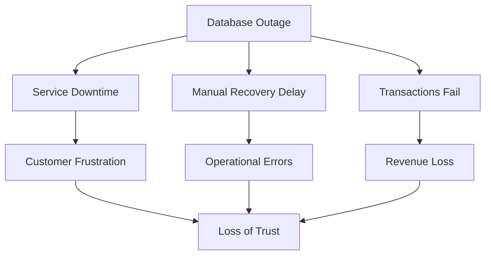
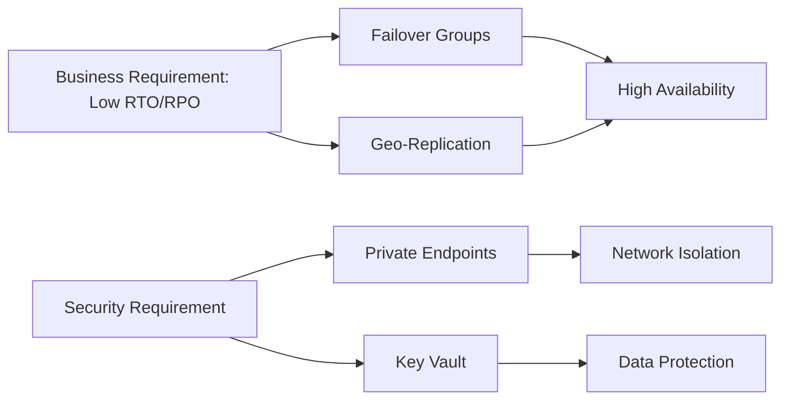
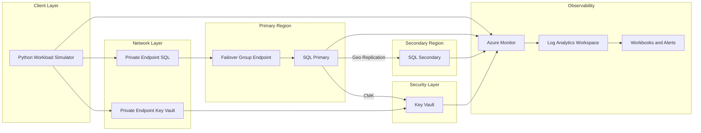
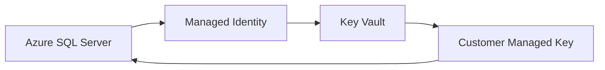

# Design and Deployment of Secure Azure SQL PaaS with Cross-Region High Availability 

## 🔴 Problem Overview

In banking and fintech payment systems, a database outage is not just a technical incident; it is a

- business interruption,
- a security concern,
- and a trust problem.

 A single-region SQL deployment with public access and manual recovery introduces three serious risks:
 
| Risk                | Description          | Business Impact             |
| ------------------- | -------------------- | --------------------------- |
| Downtime            | No high availability | Transactions stop           |
| Exposure            | Public endpoints     | Increased attack surface    |
| Operational Failure | Manual recovery      | Slow + error-prone recovery |

## 🎯 Engineering Objective

Design and Deploy a secure, highly available Azure SQL platform that:

- meets RTO (15–30 min) and RPO (≤ 5 min) targets
- eliminates public exposure through private connectivity
- enables automated, cross-region failover

| Problem      | Solution               | Azure Feature     |
| ------------ | ---------------------- | ----------------- |
| Downtime     | Automatic failover     | Failover Groups   |
| Data Loss    | Continuous replication | Geo-replication   |
| Exposure     | Private access only    | Private Endpoints |
| Key Security | Encryption control     | Key Vault         |

## 🏗️ System Architecture

## 🌍 Region Selection (RPO/RTO Driven)

| Role             | Region         |
|------------------|---------------|
| Primary          | Central India |
| Secondary        | South India   |

**Trade-off Consideration**

| Option                          | Impact                              |
|---------------------------------|-------------------------------------|
| Nearby regions (chosen)         | Better RPO, faster RTO              |
| Distant regions (e.g., India → Europe) | Higher latency → worse RPO |

## 🧪 Replication Strategy (Failover Groups / Geo-Replication)

This architecture intentionally combines Failover Groups and Active Geo-Replication within the same Azure SQL environment to evaluate their operational behavior and recovery characteristics.

The environment provisions 20 databases:

- 10 databases use Failover Groups for automated failover and managed replication  
- 10 databases use Active Geo-Replication with manually managed secondary databases  

This design enables direct comparison of failover behavior, recovery time, and operational complexity across both models.

## 🔐 Security and Encryption (Key Vault + CMK)

To meet security and compliance requirements, the architecture implements Transparent Data Encryption (TDE) using Customer-Managed Keys (CMK) stored in Azure Key Vault.

### Key Components

| Component | Role |
|----------|------|
| Azure SQL Server | Encrypts data at rest |
| Managed Identity | Authenticates SQL Server to Key Vault |
| Key Vault | Secure storage for encryption keys |
| Customer-Managed Key (CMK) | Used for TDE encryption |

---

### 🔑 Encryption Flow

## 🚧 Next Phase: Workload Simulation and Validation

The next phase of this project will introduce a Python-based workload simulator to validate the behavior of the architecture under real-world conditions.

This will include:

- continuous data ingestion and query execution
- failover testing across regions
- measurement of recovery time against defined RTO (15–30 minutes)
- evaluation of data consistency against RPO (≤ 5 minutes)

Results from this phase will be used to assess the effectiveness of the implemented high availability and security design.
