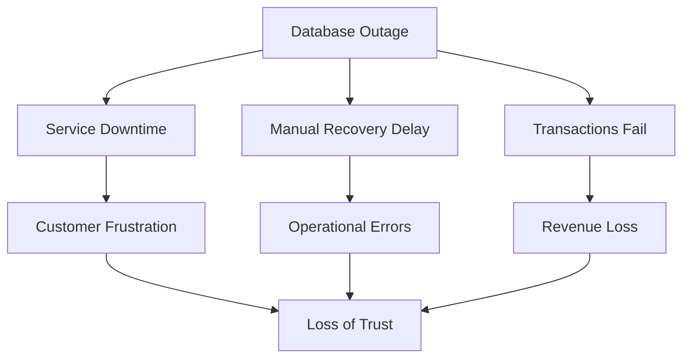
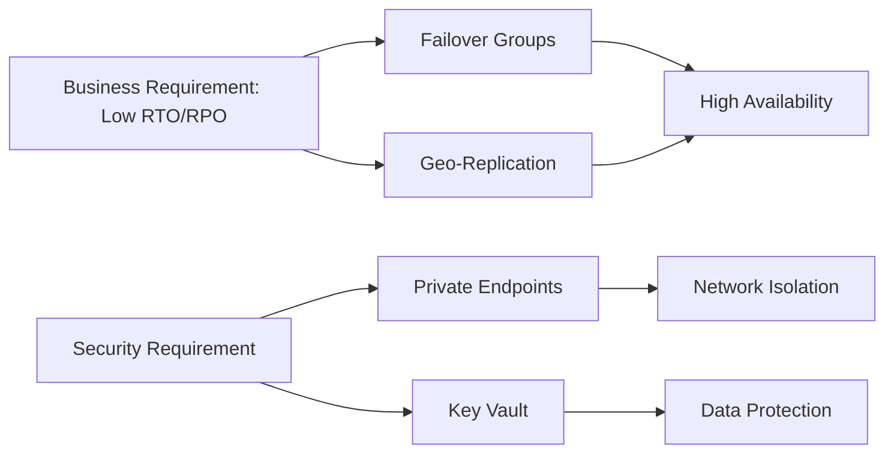

# Design and Deployment of Secure Azure SQL PaaS with Private Endpoints, Customer-Managed Keys, and Cross-Region High Availability

## 🔴 Problem OverView

In banking and fintech payment systems, a database outage is not just a technical incident; it is a

- business interruption,
- a security concern,
- and a trust problem.

 A single-region SQL deployment with public access and manual recovery introduces three serious risks:
| Risk                | Description          | Business Impact             |
| ------------------- | -------------------- | --------------------------- |
| Downtime            | No high availability | Transactions stop           |
| Exposure            | Public endpoints     | Increased attack surface    |
| Operational Failure | Manual recovery      | Slow + error-prone recovery |

## 🎯 Design Objective

Design a secure, highly available Azure SQL platform that:

- meets RTO (15–30 min) and RPO (≤ 5 min) targets
- eliminates public exposure through private connectivity
- enables automated, cross-region failover

| Problem      | Solution               | Azure Feature     |
| ------------ | ---------------------- | ----------------- |
| Downtime     | Automatic failover     | Failover Groups   |
| Data Loss    | Continuous replication | Geo-replication   |
| Exposure     | Private access only    | Private Endpoints |
| Key Security | Encryption control     | Key Vault         |

## 🏗️ System Architecture

The architecture implements a secure, private, and highly available Azure SQL deployment across primary and secondary regions to meet defined RTO/RPO targets.
