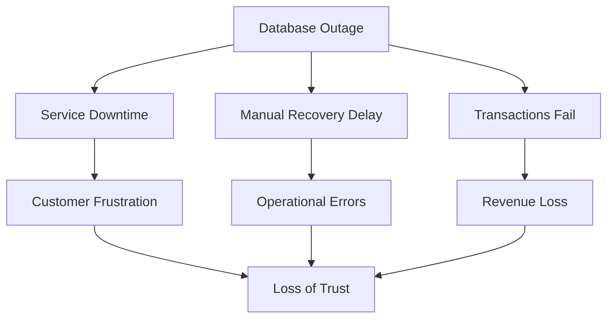
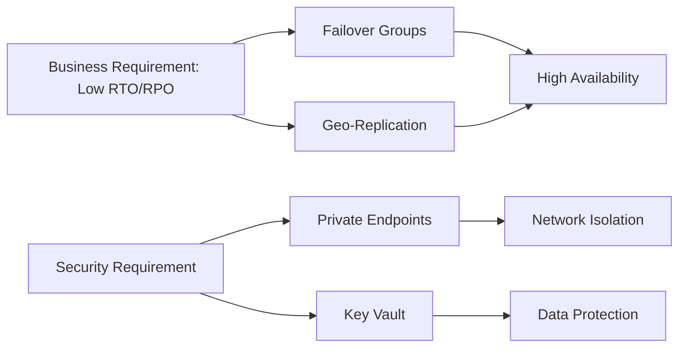
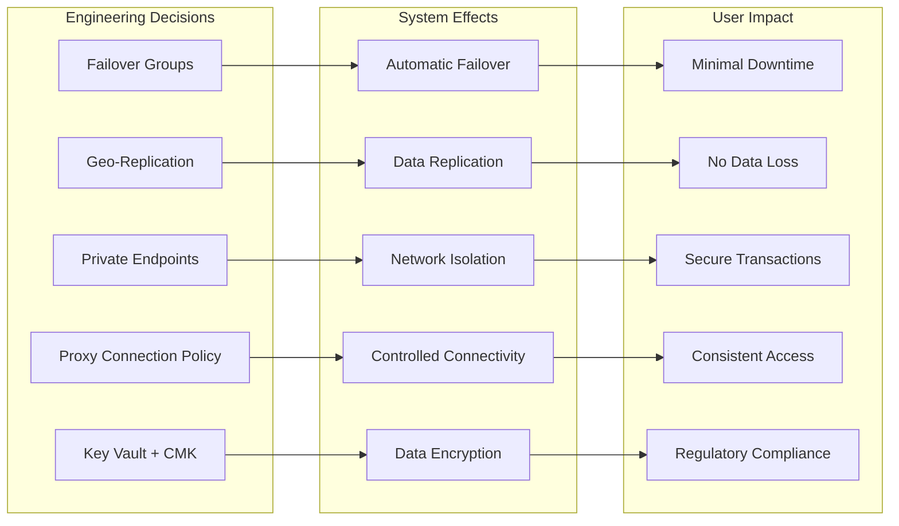
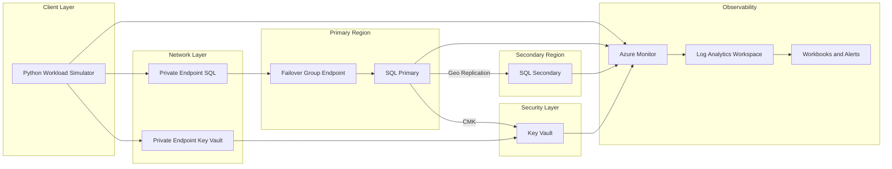
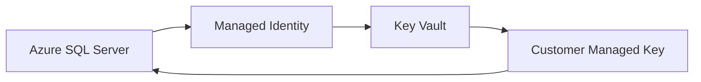
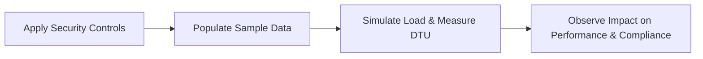
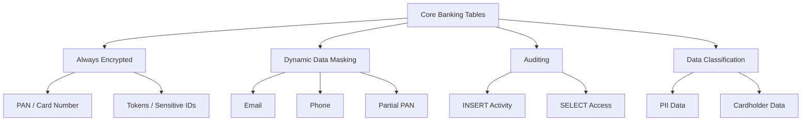

# Design and Deployment of Secure Azure SQL PaaS with Cross-Region High Availability


## 🔴 Problem Overview

In banking and fintech payment systems, a database outage is not just a technical incident; it is a

- business interruption,
- a security concern,
- and a trust problem.

 A single-region SQL deployment with public access and manual recovery introduces three serious risks:

| Risk                | Description          | Business Impact             |
| ------------------- | -------------------- | --------------------------- |
| Downtime            | No high availability | Transactions stop           |
| Exposure            | Public endpoints     | Increased attack surface    |
| Operational Failure | Manual recovery      | Slow + error-prone recovery |





## 🎯 Engineering Objective

Design and Deploy a secure, highly available Azure SQL platform that:

- meets RTO (15–30 min) and RPO (≤ 5 min) targets
- eliminates public exposure through private connectivity
- enables automated, cross-region failover


| Problem      | Solution               | Azure Feature     |
| ------------ | ---------------------- | ----------------- |
| Downtime     | Automatic failover     | Failover Groups   |
| Data Loss    | Continuous replication | Geo-replication   |
| Exposure     | Private access only    | Private Endpoints |
| Key Security | Encryption control     | Key Vault         |



## User Impact

This diagram shows how key engineering decisions translate into measurable user and business outcomes.



## 🏗️ System Architecture




## 🌍 Region Selection (RPO/RTO Driven)

| Role             | Region         |
|------------------|---------------|
| Primary          | Central India |
| Secondary        | South India   |

**Trade-off Consideration**

| Option                          | Impact                              |
|---------------------------------|-------------------------------------|
| Nearby regions (chosen)         | Better RPO, faster RTO              |
| Distant regions (e.g., India → Europe) | Higher latency → worse RPO |


##  🔌 Connection Policy Selection

| Policy   | Connectivity Model                  | Network Requirement              | Performance | Suitability for Banking Environment |
|----------|------------------------------------|----------------------------------|------------|-------------------------------------|
| Proxy ✅ | Gateway-only (port 1433)           | Minimal (single port)            | Lower      | ✅ Best fit (controlled, compliant)  |
| Redirect | Direct to database node            | Requires ports 11000–11999 open  | High       | ❌ Not suitable (breaks lockdown)    |
| Default  | Redirect → Proxy fallback          | Depends on environment           | Variable   | ⚠️ Unpredictable behavior           |

---

**Decision:**
Proxy was intentionally selected to enforce **strict network control and deterministic connectivity**, ensuring alignment with real-world banking security constraints where dynamic port access is restricted.


## 🧪 Replication Strategy (Failover Groups / Geo-Replication)

This architecture intentionally combines Failover Groups and Active Geo-Replication within the same Azure SQL environment to evaluate their operational behavior and recovery characteristics.

The environment provisions 20 databases:

- 10 databases use Failover Groups for automated failover and managed replication
- 10 databases use Active Geo-Replication with manually managed secondary databases

This design enables direct comparison of failover behavior, recovery time, and operational complexity across both models.


## 🔐 Security and Encryption (Key Vault + CMK)

To meet security and compliance requirements, the architecture implements Transparent Data Encryption (TDE) using Customer-Managed Keys (CMK) stored in Azure Key Vault.

### Key Components

| Component | Role |
|----------|------|
| Azure SQL Server | Encrypts data at rest |
| Managed Identity | Authenticates SQL Server to Key Vault |
| Key Vault | Secure storage for encryption keys |
| Customer-Managed Key (CMK) | Used for TDE encryption |

---

### 🔑 Encryption Flow



### 🔐 Identity and Access Management (Microsoft Entra ID)

Authentication and access to Azure SQL are managed using both Microsoft Entra ID (Azure AD) and SQL Login as often used in the real world and enabling centralized identity control.

### Key Decisions

| Component | Purpose |
|----------|--------|
| Entra Admin | Central administrative access to SQL Server |
| Database Users | Granular, role-based access control |
| Role Assignment | Enforces least privilege |

### Implementation

- A Microsoft Entra ID admin is configured at the SQL server level -- automated scripts can be found in 

 ``` bash 
/scripts/shell/set-entra-admin.sh file.
```
- Database users are created from the external provider (Entra ID)  
``` sql
sql CREATE USER [user@domain.com] FROM EXTERNAL PROVIDER; 
```

- Access is granted using built-in roles (db_datareader, db_datawriter, etc.)
```sql
ALTER ROLE db_datareader ADD MEMBER [user@domain.com]; 
```


### Workload Simulation Planning & Objectives

#### 🎯 Objective

| Area                          | Description                                                                                                                                    |
| ----------------------------- | ---------------------------------------------------------------------------------------------------------------------------------------------- |
| **Data Population & Testing** | Populate a minimal set of banking tables with sample data to simulate load, measure DTU usage, and observe system behavior.                    |
| **Security Controls**         | Apply layered protections (encryption, masking, auditing, classification) to secure sensitive data during and after testing (PCI-DSS aligned). |


#### ⚙️ Approach



#### 🔐 Security Control



#### 🔍 Control Breakdown

| Control                 | What It Protects                     | Why It Matters                                   |
| ----------------------- | ------------------------------------ | ------------------------------------------------ |
| **Always Encrypted**    | Card numbers, tokens, sensitive data | Keeps critical data fully protected at all times |
| **Data Masking (DDM)**  | Email, phone, partial card numbers   | Hides sensitive data from unauthorized users     |
| **Auditing**            | User activity (reads and writes)     | Tracks who did what for security and compliance  |
| **Data Classification** | Personal and cardholder data         | Helps identify and manage sensitive information  |


A production transaction, cards and accounts table was mirrored and intentionally simplified by excluding non-essential columns. The goal is to retain only the minimum set of fields required to demonstrate key Azure SQL security controls, including Dynamic Data Masking, Data Classification, and Always encrypted. This approach reduces noise while preserving the structural and sensitivity characteristics necessary to model real-world financial data protection scenarios.


Using cards and transactions table as a major reference for this doc

##### tbl_transactions (before)

| Column                          | Data Type            | Nullability | Constraints                  |
|--------------------------------|----------------------|------------|------------------------------|
| transaction_sub_type           | nvarchar(31)         | NOT NULL   |                              |
| id                             | bigint               | NOT NULL   | IDENTITY, PRIMARY KEY        |
| amount                         | numeric(19,2)        | NULL       |                              |
| charged_fee                    | float                | NULL       |                              |
| created_by                     | nvarchar(255)        | NULL       |                              |
| created_on                     | datetime2(7)         | NULL       |                              |
| currency_code                  | nvarchar(255)        | NULL       |                              |
| current_workflow_step          | int                  | NULL       |                              |
| destination_account_name       | nvarchar(255)        | NULL       |                              |
| destination_account_number     | nvarchar(255)        | NULL       |                              |
| destination_bank_code          | nvarchar(255)        | NULL       |                              |
| transaction_type               | nvarchar(255)        | NULL       |                              |
| transaction_external_reference | nvarchar(255)        | NULL       |                              |
| modified_by                    | nvarchar(255)        | NULL       |                              |
| modified_on                    | datetime2(7)         | NULL       |                              |
| narration                      | nvarchar(255)        | NULL       |                              |
| narration_extended             | nvarchar(255)        | NULL       |                              |
| reversal_date                  | datetime2(7)         | NULL       |                              |
| reversal_status                | nvarchar(255)        | NULL       |                              |
| reversed                       | bit                  | NULL       |                              |
| session_key                    | nvarchar(255)        | NULL       |                              |
| source_account_number          | nvarchar(255)        | NULL       |                              |
| transaction_final_status       | nvarchar(255)        | NULL       |                              |
| transaction_posting_reference  | nvarchar(255)        | NULL       |                              |
| transaction_reference          | nvarchar(255)        | NULL       |                              |
| transaction_request_date       | datetime2(7)         | NULL       |                              |
| transaction_request_status     | nvarchar(255)        | NULL       |                              |
| transaction_request_status_code| nvarchar(255)        | NULL       |                              |
| transaction_response_date      | datetime2(7)         | NULL       |                              |
| vat_inclusive                  | bit                  | NULL       |                              |
| user_name                      | nvarchar(50)         | NOT NULL   |                              |
| OldId                          | bigint               | NULL       |                              |
| batch_id                       | nvarchar(255)        | NULL       | FOREIGN KEY (referenced)     |
| destination_bank_name          | nvarchar(255)        | NULL       |                              |
| misc_data                      | nvarchar(2000)       | NULL       |                              |
| recharge_pin                   | nvarchar(255)        | NULL       |                              |
| any_authorizer_accepted        | nvarchar(10)         | NULL       |                              |
| is_salary                      | bit                  | NULL       |                              |
| isw_client_reference           | nvarchar(255)        | NULL       |                              |
| isw_transaction_reference      | nvarchar(255)        | NULL       |                              |
| bill_payments_type             | nvarchar(255)        | NULL       |                              |
| electricity_token              | nvarchar(255)        | NULL       |                              |
| transaction_custom_reference   | nvarchar(255)        | NULL       |                              |
| purpose                        | nvarchar(255)        | NULL       |                              |
| sort_code                      | nvarchar(255)        | NULL       |                              |
| request_transaction_id         | nvarchar(255)        | NULL       |                              |
| notification_status            | nvarchar(255)        | NULL       |                              |


##### tbl_transactions (after)

| Column                          | Data Type      | Nullability | Constraints / Security Controls                              |
|--------------------------------|----------------|-------------|--------------------------------------------------------------|
| id                             | bigint         | NOT NULL    | IDENTITY, PRIMARY KEY                                        |
| transaction_sub_type           | nvarchar(31)   | NOT NULL    |                                                              |
| transaction_type               | nvarchar(100)  | NULL        |                                                              |
| amount                         | decimal(19,2)  | NULL        | Sensitivity Classification (Financial)                       |
| charged_fee                    | decimal(19,2)  | NULL        |                                                              |
| currency_code                  | char(3)        | NULL        |                                                              |
| source_account_number          | nvarchar(20)   | NULL        | DDM: partial(0,"XXXXXXX",4), Classified: Highly Confidential |
| destination_account_number     | nvarchar(20)   | NULL        | DDM: partial(0,"XXXXXXX",4), Classified: Highly Confidential |
| destination_account_name       | nvarchar(150)  | NULL        | DDM: partial(1,"XXXX",1)                                     |
| destination_bank_code          | nvarchar(20)   | NULL        |                                                              |
| destination_bank_name          | nvarchar(150)  | NULL        |                                                              |
| sort_code                      | nvarchar(20)   | NULL        |                                                              |
| transaction_reference          | nvarchar(100)  | NULL        |                                                              |
| transaction_external_reference | nvarchar(100)  | NULL        |                                                              |
| transaction_posting_reference  | nvarchar(100)  | NULL        |                                                              |
| transaction_custom_reference   | nvarchar(100)  | NULL        |                                                              |
| isw_transaction_reference      | nvarchar(100)  | NULL        |                                                              |
| request_transaction_id         | nvarchar(100)  | NULL        |                                                              |
| transaction_final_status       | nvarchar(50)   | NULL        |                                                              |
| transaction_request_status     | nvarchar(50)   | NULL        |                                                              |
| transaction_request_status_code| nvarchar(50)   | NULL        |                                                              |
| transaction_request_date       | datetime2      | NULL        |                                                              |
| transaction_response_date      | datetime2      | NULL        |                                                              |
| reversal_date                  | datetime2      | NULL        |                                                              |
| reversed                       | bit            | NULL        |                                                              |
| vat_inclusive                  | bit            | NULL        |                                                              |
| is_salary                      | bit            | NULL        |                                                              |
| session_key                    | nvarchar(255)  | NULL        | DDM: default(), Classified: Highly Confidential              |
| recharge_pin                   | nvarchar(50)   | NULL        | DDM: default(), Classified: Highly Confidential              |
| electricity_token              | nvarchar(100)  | NULL        | DDM: default()                                               |
| misc_data                      | nvarchar(2000) | NULL        | DDM: default()                                               |
| user_name                      | nvarchar(50)   | NOT NULL    | DDM: partial(1,"****",1), Classified: Confidential           |
| created_by                     | nvarchar(100)  | NULL        | DDM: partial(1,"****",1)                                     |
| modified_by                    | nvarchar(100)  | NULL        | DDM: partial(1,"****",1)                                     |
| created_on                     | datetime2      | NULL        |                                                              |
| modified_on                    | datetime2      | NULL        |                                                              |
| narration                      | nvarchar(255)  | NULL        |                                                              |
| narration_extended             | nvarchar(255)  | NULL        |                                                              |
| batch_id                       | nvarchar(100)  | NULL        |                                                              |
| notification_status            | nvarchar(50)   | NULL        |                                                              |


These columns were intentionally excluded to reduce noise and focus on security-relevant concepts:

| Removed Column              | Reason |
|----------------------------|--------|
| current_workflow_step      | Operational metadata |
| reversal_status            | Non-essential for security demo |
| OldId                      | Legacy migration field |
| any_authorizer_accepted    | Workflow-specific |
| isw_client_reference       | Redundant reference field |
| bill_payments_type         | Business-specific logic |
| purpose                    | Non-essential narrative field |


##### sql server auditing


--- screenshot of logs that shows actions performed on the db.
