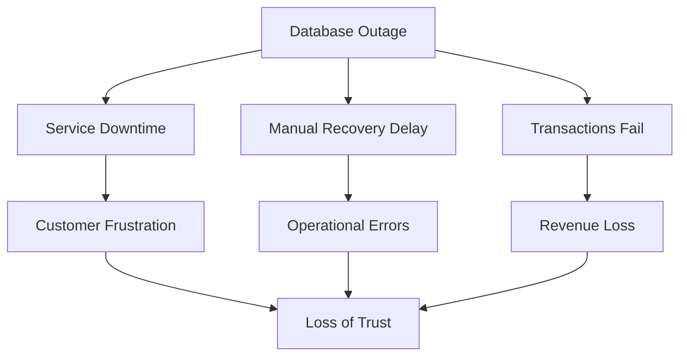
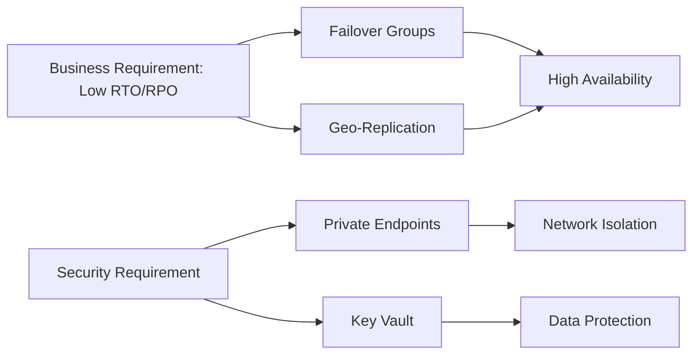
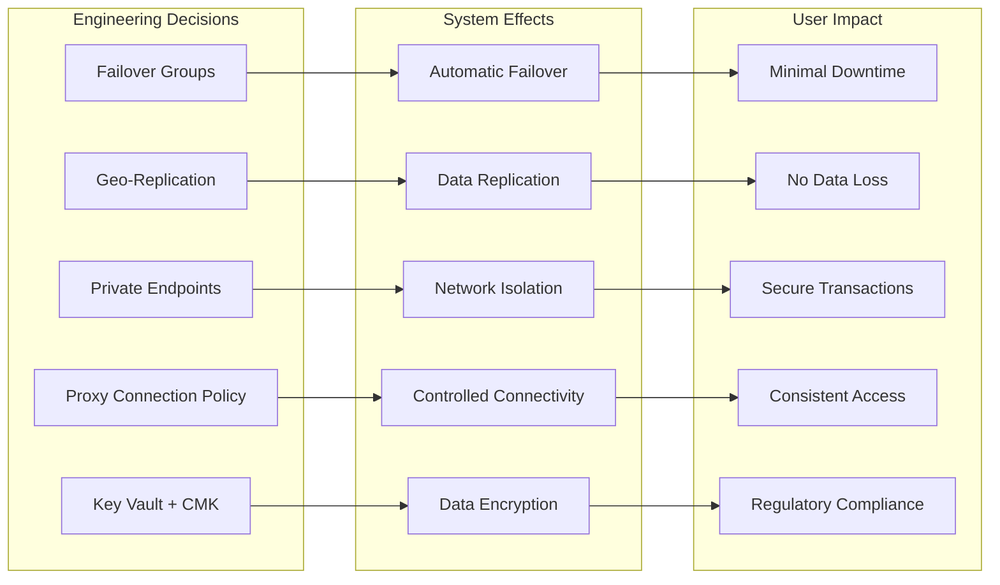
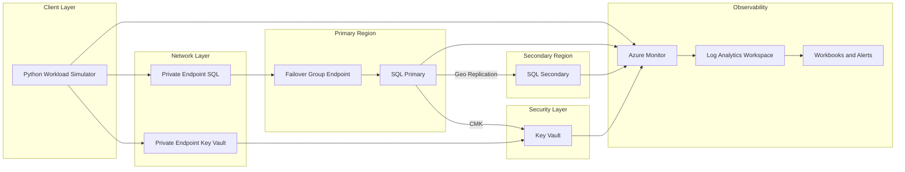
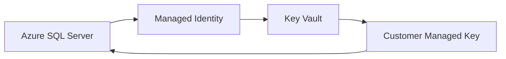
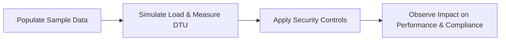
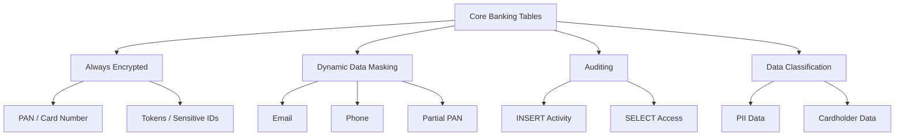

# Design and Deployment of Secure Azure SQL PaaS with Cross-Region High Availability

## 🔴 Problem Overview

In banking and fintech payment systems, a database outage is not just a technical incident; it is a

- business interruption,
- a security concern,
- and a trust problem.

 A single-region SQL deployment with public access and manual recovery introduces three serious risks:

| Risk                | Description          | Business Impact             |
| ------------------- | -------------------- | --------------------------- |
| Downtime            | No high availability | Transactions stop           |
| Exposure            | Public endpoints     | Increased attack surface    |
| Operational Failure | Manual recovery      | Slow + error-prone recovery |

## 🎯 Engineering Objective

Design and Deploy a secure, highly available Azure SQL platform that:

- meets RTO (15–30 min) and RPO (≤ 5 min) targets
- eliminates public exposure through private connectivity
- enables automated, cross-region failover

| Problem      | Solution               | Azure Feature     |
| ------------ | ---------------------- | ----------------- |
| Downtime     | Automatic failover     | Failover Groups   |
| Data Loss    | Continuous replication | Geo-replication   |
| Exposure     | Private access only    | Private Endpoints |
| Key Security | Encryption control     | Key Vault         |

## User Impact

This diagram shows how key engineering decisions translate into measurable user and business outcomes.

## 🏗️ System Architecture

## 🌍 Region Selection (RPO/RTO Driven)

| Role             | Region         |
|------------------|---------------|
| Primary          | Central India |
| Secondary        | South India   |

**Trade-off Consideration**

| Option                          | Impact                              |
|---------------------------------|-------------------------------------|
| Nearby regions (chosen)         | Better RPO, faster RTO              |
| Distant regions (e.g., India → Europe) | Higher latency → worse RPO |

##  🔌 Connection Policy Selection

| Policy   | Connectivity Model                  | Network Requirement              | Performance | Suitability for Banking Environment |
|----------|------------------------------------|----------------------------------|------------|-------------------------------------|
| Proxy ✅ | Gateway-only (port 1433)           | Minimal (single port)            | Lower      | ✅ Best fit (controlled, compliant)  |
| Redirect | Direct to database node            | Requires ports 11000–11999 open  | High       | ❌ Not suitable (breaks lockdown)    |
| Default  | Redirect → Proxy fallback          | Depends on environment           | Variable   | ⚠️ Unpredictable behavior           |

---

**Decision:**
Proxy was intentionally selected to enforce **strict network control and deterministic connectivity**, ensuring alignment with real-world banking security constraints where dynamic port access is restricted.

## 🧪 Replication Strategy (Failover Groups / Geo-Replication)

This architecture intentionally combines Failover Groups and Active Geo-Replication within the same Azure SQL environment to evaluate their operational behavior and recovery characteristics.

The environment provisions 20 databases:

- 10 databases use Failover Groups for automated failover and managed replication
- 10 databases use Active Geo-Replication with manually managed secondary databases

This design enables direct comparison of failover behavior, recovery time, and operational complexity across both models.

## 🔐 Security and Encryption (Key Vault + CMK)

To meet security and compliance requirements, the architecture implements Transparent Data Encryption (TDE) using Customer-Managed Keys (CMK) stored in Azure Key Vault.

### Key Components

| Component | Role |
|----------|------|
| Azure SQL Server | Encrypts data at rest |
| Managed Identity | Authenticates SQL Server to Key Vault |
| Key Vault | Secure storage for encryption keys |
| Customer-Managed Key (CMK) | Used for TDE encryption |

---

### 🔑 Encryption Flow

### Workload Simulation Planning & Objectives

#### 🎯 Objective

| Area                          | Description                                                                                                                                    |
| ----------------------------- | ---------------------------------------------------------------------------------------------------------------------------------------------- |
| **Data Population & Testing** | Populate a minimal set of banking tables with sample data to simulate load, measure DTU usage, and observe system behavior.                    |
| **Security Controls**         | Apply layered protections (encryption, masking, auditing, classification) to secure sensitive data during and after testing (PCI-DSS aligned). |

#### ⚙️ Approach

#### 🔐 Security Control

#### 🔍 Control Breakdown

| Control                 | What It Protects                     | Why It Matters                                   |
| ----------------------- | ------------------------------------ | ------------------------------------------------ |
| **Always Encrypted**    | Card numbers, tokens, sensitive data | Keeps critical data fully protected at all times |
| **Data Masking (DDM)**  | Email, phone, partial card numbers   | Hides sensitive data from unauthorized users     |
| **Auditing**            | User activity (reads and writes)     | Tracks who did what for security and compliance  |
| **Data Classification** | Personal and cardholder data         | Helps identify and manage sensitive information  |

📝 Note

These controls ensure sensitive banking data is protected, controlled, and traceable, while supporting compliance requirements like PCI DSS.