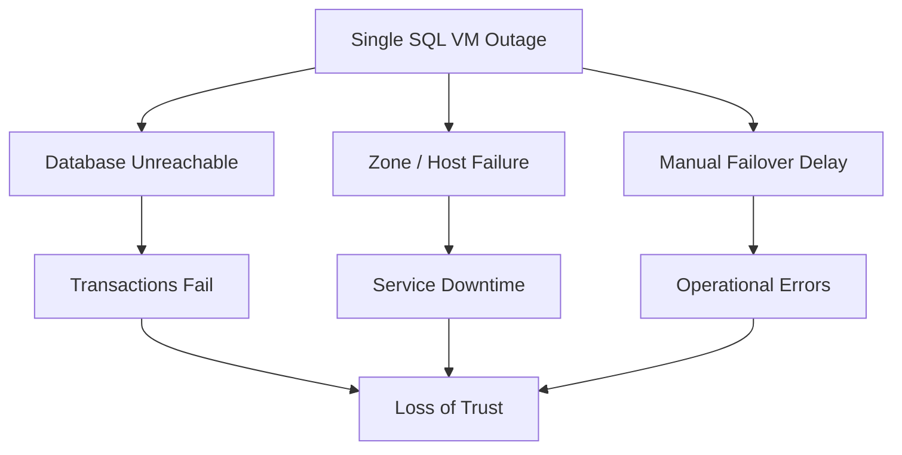
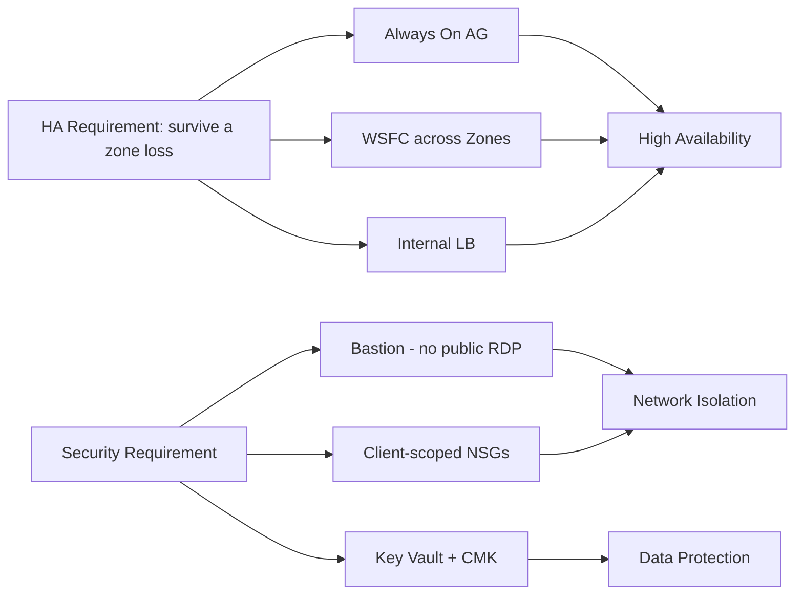
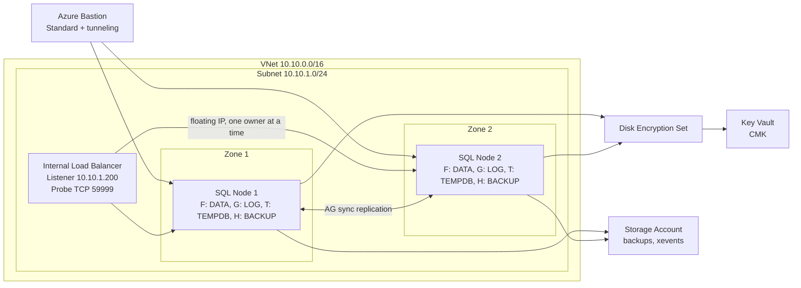
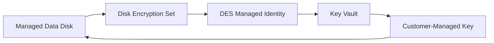

# Secure, Zone-Redundant SQL Server on Azure VMs (IaaS) with Always On Availability Groups

This document describes the **IaaS** track of the platform: SQL Server 2022 running on
**Windows Server VMs** made highly available with **Always On Availability Groups (AGs)**
across **two availability zones**, fronted by an internal load balancer listener, secured
with private access and customer-managed encryption.

It is the sibling of the managed-database design in
[paas-database.md](paas-database.md). Where the PaaS doc delivers HA/DR through
Azure SQL Database *Failover Groups*, this doc delivers it by running the database engine
ourselves on VMs — trading managed convenience for full control of the OS, the SQL
instance, and the clustering layer.

---

## 🔴 Problem Overview

Running SQL Server yourself on VMs reintroduces every responsibility the PaaS service used
to hide. A naive "one SQL VM, public RDP, manual recovery" deployment carries three
classes of risk:

| Risk                | Description                                  | Business Impact                  |
| ------------------- | -------------------------------------------- | -------------------------------- |
| Single point of failure | One VM / one zone — host or zone outage stops the database | Transactions stop |
| Exposure            | Public RDP/SQL ports, plaintext disks        | Large attack surface, data theft |
| Operational failure | Manual failover and disk setup               | Slow, error-prone recovery       |

---

## 🎯 Engineering Objective

Build a secure, highly available SQL Server platform on VMs that survives a zone failure,
and protects data at rest — while staying
deployable inside an identity-restricted sandbox.

| Problem                       | Solution                              | Azure / SQL Feature                         |
| ----------------------------- | ------------------------------------- | ------------------------------------------- |
| Node / zone outage            | Synchronous replicas across zones     | **Always On AG** + **WSFC**, Zone 1 / Zone 2 |
| Slow client reconnect on failover | Single floating listener endpoint  | **Internal Load Balancer** (floating IP + health probe) |
| Public exposure               | Attack surface reduced to an allowlisted `/32` (not eliminated) | **Azure Bastion** for interactive admin + allowlisted public **WinRM/SSH** for Ansible, NSG-scoped to the operator IP |
| Data at rest                  | Customer-controlled disk encryption   | **Key Vault CMK** + **Disk Encryption Set (SSE)** |
| Identity (no domain)          | Cluster trust without Active Directory | **Local accounts + certificate HADR endpoints** |

---

## 🧭 Why an IaaS Track Alongside PaaS

The PaaS database already meets the HA/DR goals with less operational burden. The VM track
exists for the cases PaaS cannot cover:

| Driver                     | Why it needs IaaS                                                        |
| -------------------------- | ----------------------------------------------------------------------- |
| Full OS + instance control | Agent installs, trace flags, file placement, instance-level configuration |
| Always On AG demonstration | Show WSFC, synchronous replicas, listener failover end-to-end           |
| No-Active-Directory lab     | Prove a **workgroup cluster** with certificate-based trust (no domain)   |

---

## 🏗️ System Architecture

Both SQL nodes share one subnet but sit in **different availability zones**. The internal
load balancer publishes the AG listener's floating IP; Bastion brokers private admin
access; Key Vault holds the CMK that the Disk Encryption Set wraps every data disk with.

---

## 🌍 Region & Availability-Zone Strategy

| Role            | Placement                |
| --------------- | ------------------------ |
| Region          | Central India (single)   |
| SQL Node 1      | Availability **Zone 1**  |
| SQL Node 2      | Availability **Zone 2**  |

HA here is **intra-region, cross-zone**: a zone failure takes at most one replica. (The
PaaS track adds *cross-region* DR via Failover Groups; the VM track demonstrates zonal HA.)

**Trade-off — disk redundancy:**

| Option                                  | Impact                                                              |
| --------------------------------------- | ------------------------------------------------------------------ |
| Zonal **LRS** disks pinned to the VM zone (chosen) | A managed disk must live in the same zone as its VM; cross-zone durability comes from **AG replication**, not the disk |
| **ZRS** disks                            | Zone-redundant at the storage layer, but the AG already replicates data, so LRS-per-zone is sufficient and cheaper here |

---

## 🔌 Single-Subnet + Internal-Load-Balancer Listener Decision

Both replicas live in **one subnet** (`10.10.1.0/24`). A single-subnet AG cannot advertise
a multi-subnet VNN listener, so the listener IP is published by an **internal load
balancer** using a *floating IP* (direct server return): only the replica that currently
owns the AG answers on `10.10.1.200:1433`, and a **TCP health probe on 59999** tells the LB
which node that is.

| Connectivity model            | Mechanism                                  | Suitability here                         |
| ----------------------------- | ------------------------------------------ | ---------------------------------------- |
| Internal LB + floating IP ✅  | Probe-driven failover within one subnet     | ✅ Required for a single-subnet AG        |
| Multi-subnet VNN listener     | DNS registers all replica IPs              | ❌ Needs replicas in separate subnets     |
| **DNN** listener (SQL 2019 CU8+) | DNS-based, no LB at all                   | ⚠️ Modern alternative; removes the LB/probe entirely |

The load balancer is **Standard, internal, regional**, with a zone-redundant frontend so
it survives a zone loss. Two NSG rules (sourced from the `AzureLoadBalancer` and
`VirtualNetwork` service tags to ports `1433` + `59999`) are **resolved against whichever
NSG is actually attached to each node's NIC**, so the listener keeps working even if the
NSG wiring drifts. See [load-balancer.sh](../scripts/shell/test-env/load-balancer.sh).

---

## 🖥️ Compute Layer

| Aspect           | Value                                              | Why                                                                 |
| ---------------- | ------------------------------------------------- | ------------------------------------------------------------------- |
| Image            | Windows Server 2022 Datacenter (Azure Edition)    | Base OS with no Marketplace plan/terms to accept                    |
| SQL Server       | 2022 **Developer**, downloaded + installed in-guest | Free, full-featured for a lab; avoids Marketplace image licensing   |
| VM size          | `Standard_B2ms` (2 vCPU / 4 GB)                   | Modest, sandbox-sized; raise for real workloads                     |
| Identity         | System-assigned **managed identity**              | Lets the VM authenticate to Key Vault without stored secrets        |
| Remote mgmt      | **WinRM** HTTP/5985 (NTLM)                         | How Ansible configures Windows; NSG limits it to the client IP      |

> **Sandbox vs production:** WinRM here is HTTP (5985) for fast iteration. Production should
> use the HTTPS listener (5986) with a real certificate. SQL Developer edition is not
> licensed for production use.

See [win-sql-vm.sh](../scripts/shell/test-env/win-sql-vm.sh) (Node 1) and
`win-sql-vm-2.sh` (Node 2).

---

## 💾 Storage Layer — Encrypted Data Disks

Each node gets four dedicated, CMK-encrypted data disks, formatted **NTFS with a 64 KB
allocation unit** (the SQL Server I/O best practice) and laid out for I/O isolation:

| LUN | Drive | Label     | Size (GB) | Purpose                | Host caching | Why this caching             |
| --- | ----- | --------- | --------- | ---------------------- | ------------ | ---------------------------- |
| 0   | F:    | SQLDATA   | 4022      | Data files             | ReadOnly     | Read-heavy; cache speeds reads |
| 1   | G:    | SQLLOG    | 2011      | Transaction log        | None         | Log writes must be durable    |
| 2   | T:    | SQLTEMPDB | 1024      | tempdb                 | ReadOnly     | Scratch; read cache is safe   |
| 3   | H:    | SQLBACKUP | 8124      | Backups                | None         | Sequential writes; no caching |

- **Zonal pinning:** a managed disk must be in the same zone as its VM, so Node 1's disks
  are created in Zone 1 and Node 2's in Zone 2.
- **Order:** Windows attaches disks to an existing VM, so the pattern is *VM first, then
  disks* (the reverse of the Linux track).
- **Self-healing in-guest config:** the disk playbook detects "needs formatting" at the
  **volume** level (no NTFS filesystem), not just the disk level. This recovers a disk that
  a previous interrupted run left *partitioned but unformatted* (the classic
  "inaccessible Local Disk with no capacity bar") without any manual clicking — see
  [windows-dbdrive-configuration.yml](../ansible/playbooks/windows-dbdrive-configuration.yml).

See [win-encrypted-disks.sh](../scripts/shell/test-env/win-encrypted-disks.sh) /
`win-encrypted-disks-2.sh`.

---

## 🔐 Security & Encryption

**Encryption at rest** uses Server-Side Encryption with a Customer-Managed Key. Every data
disk is wrapped by a **Disk Encryption Set (DES)** whose system identity is granted
`wrap`/`unwrap` on a Key Vault key — so the customer controls the key lifecycle:

**Network exposure** is minimized in layers:

| Control                 | What it does                                                            | Why                                                |
| ----------------------- | ---------------------------------------------------------------------- | -------------------------------------------------- |
| **Azure Bastion**       | Brokers RDP/SSH to private IPs (Standard SKU + tunneling)              | Production path for interactive admin; Ansible instead uses the allowlisted public IP (next row) |
| **NSGs scoped to client IP** | Allow only RDP 3389 / WinRM 5985 / SQL 1433 from the operator's IP | Shrinks the attack surface to one address          |
| **LB listener rules**   | Allow `AzureLoadBalancer` + `VirtualNetwork` → 1433 / 59999           | Without them the probe is dropped and the listener silently fails |
| **`asg-win-<suffix>` ASG** | Groups all SQL VM NICs (Linux + Windows nodes) for internet-facing 1433 access | Allows peer SQL engine access over public IPs without per-IP rules |
| **`asg-sqlcluster` ASG** | Groups the two Windows node NICs for intra-cluster port rules | Lets five inbound NSG rules (SQL/HADR/heartbeat/RPC) apply to both nodes ASG-to-ASG; internet traffic cannot spoof ASG membership |

Key Vault also stores the CMK and the SSH key secrets. See
[key-vault.sh](../scripts/shell/test-env/key-vault.sh),
[bastion.sh](../scripts/shell/test-env/bastion.sh),
[network.sh](../scripts/shell/test-env/network.sh), and
[application-security-group.sh](../scripts/shell/test-env/application-security-group.sh).

---
