# Secure, Zone-Redundant SQL Server on Azure VMs (IaaS) with Always On Availability Groups

This document describes the **IaaS** track of the platform: SQL Server 2022 running on
**Windows Server VMs** made highly available with **Always On Availability Groups (AGs)**
across **two availability zones**, fronted by an internal load balancer listener, secured
with private access and customer-managed encryption for azure managed disks.

It is the sibling of the managed-database design in
[paas-database.md](paas-database.md). Where the PaaS doc delivers HA/DR through
Azure SQL Database *Failover Groups*, this doc delivers it by running the database engine
ourselves on VMs — trading managed convenience for full control of the OS, the SQL
instance, and the clustering layer.

---

## 🔴 Problem Overview

Running SQL Server yourself on VMs reintroduces every responsibility the PaaS service used
to hide. A naive "one SQL VM, public RDP, manual recovery" deployment carries three
classes of risk:

| Risk                | Description                                  | Business Impact                  |
| ------------------- | -------------------------------------------- | -------------------------------- |
| Single point of failure | One VM / one zone — host or zone outage stops the database | Transactions stop |
| Exposure            | Public RDP/SQL ports, plaintext disks        | Large attack surface, data theft |
| Operational failure | Manual failover and disk setup               | Slow, error-prone recovery       |

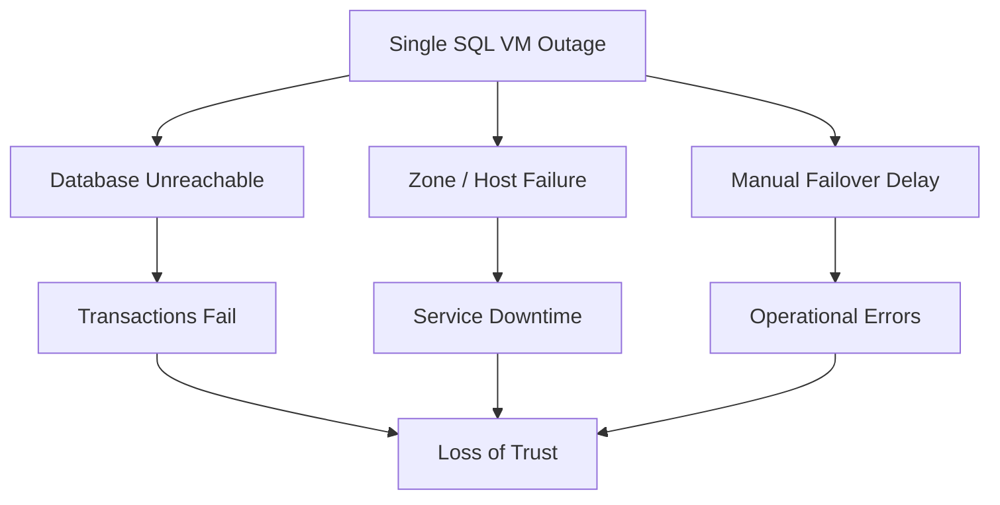

---

## 🎯 Engineering Objective

Build a secure, highly available SQL Server platform on VMs that survives a zone failure,
and protects data at rest — while staying
deployable inside an identity-restricted sandbox.

| Problem                       | Solution                              | Azure / SQL Feature                         |
| ----------------------------- | ------------------------------------- | ------------------------------------------- |
| Node / zone outage            | Synchronous replicas across zones     | **Always On AG** + **WSFC**, Zone 1 / Zone 2 |
| Slow client reconnect on failover | Single floating listener endpoint  | **Internal Load Balancer** (floating IP + health probe) |
| Public exposure               | Attack surface reduced to an allowlisted `/32` (not eliminated) | **Azure Bastion** for interactive admin + allowlisted public **WinRM/SSH** for Ansible, NSG-scoped to the operator IP |
| Data at rest                  | Customer-controlled disk encryption   | **Key Vault CMK** + **Disk Encryption Set (SSE)** |
| Identity (domain-based)       | Cluster + HADR trust via a domain      | **Dedicated AD DS + DNS Domain Controller**, Kerberos-authenticated WSFC/HADR (see [FCI/02_Active_Directory_Migration.md](Failover%20Cluster%20Instance%20%28FCI%29/02_Active_Directory_Migration.md)) |

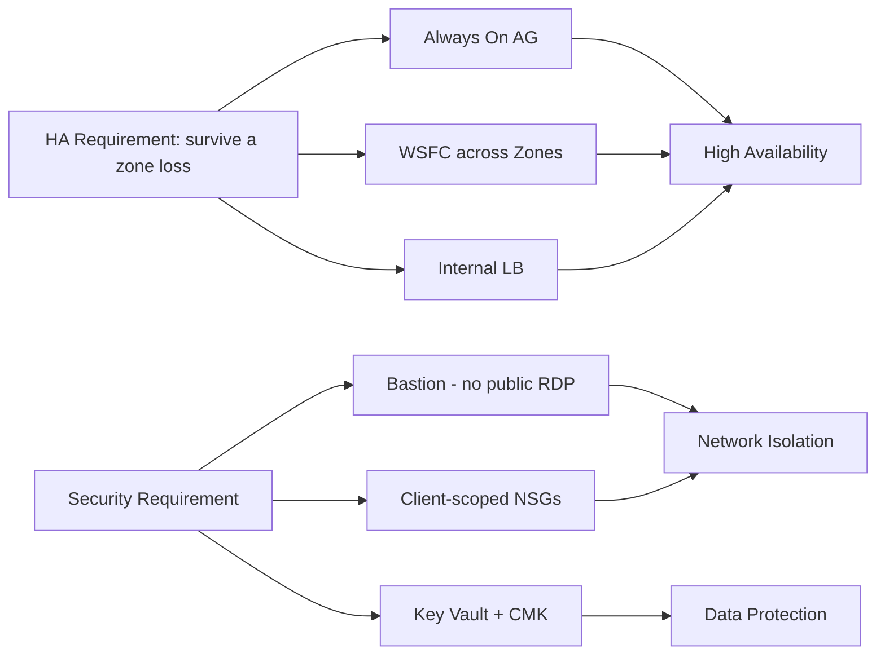

---

## 🧭 Why an IaaS Track Alongside PaaS

The PaaS database already meets the HA/DR goals with less operational burden. The VM track
exists for the cases PaaS cannot cover:

| Driver                     | Why it needs IaaS                                                        |
| -------------------------- | ----------------------------------------------------------------------- |
| Full OS + instance control | Agent installs, trace flags, file placement, instance-level configuration |
| Always On AG demonstration | Show WSFC, synchronous replicas, listener failover end-to-end           |
| Active Directory lab        | Stand up **AD DS + DNS**, then a domain-joined WSFC + Always On AG end-to-end (evolved from the earlier workgroup design — see [FCI/02](Failover%20Cluster%20Instance%20%28FCI%29/02_Active_Directory_Migration.md)) |

---

## 🏗️ System Architecture

Both SQL nodes share one subnet but sit in **different availability zones**. The internal
load balancer publishes the AG listener's floating IP; Bastion brokers private admin
access; Key Vault holds the CMK that the Disk Encryption Set wraps every data disk with.

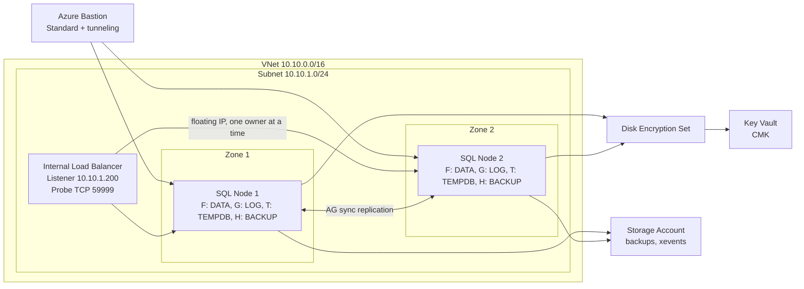

---

## 🌍 Region & Availability-Zone Strategy

| Role            | Placement                |
| --------------- | ------------------------ |
| Region          | Central India (single)   |
| SQL Node 1      | Availability **Zone 1**  |
| SQL Node 2      | Availability **Zone 2**  |

HA here is **intra-region, cross-zone**: a zone failure takes at most one replica. (The
PaaS track adds *cross-region* DR via Failover Groups; the VM track demonstrates zonal HA.)


## 🔌 Single-Subnet + Internal-Load-Balancer Listener Decision

Both replicas live in **one subnet** (`10.10.1.0/24`). A single-subnet AG cannot advertise
a multi-subnet VNN listener, so the listener IP is published by an **internal load
balancer** using a *floating IP* (direct server return): only the replica that currently
owns the AG answers on `10.10.1.200:1433`, and a **TCP health probe on 59999** tells the LB
which node that is.

| Connectivity model            | Mechanism                                  | Suitability here                         |
| ----------------------------- | ------------------------------------------ | ---------------------------------------- |
| Internal LB + floating IP ✅  | Probe-driven failover within one subnet     | ✅ Required for a single-subnet AG        |
| Multi-subnet VNN listener     | DNS registers all replica IPs              | ❌ Needs replicas in separate subnets     |
| **DNN** listener (SQL 2019 CU8+) | DNS-based, no LB at all                   | ⚠️ Modern alternative; removes the LB/probe entirely |

The load balancer is **Standard, internal, regional**, with a zone-redundant frontend so
it survives a zone loss. Two NSG rules (sourced from the `AzureLoadBalancer` and
`VirtualNetwork` service tags to ports `1433` + `59999`) are **resolved against whichever
NSG is actually attached to each node's NIC**, so the listener keeps working even if the
NSG wiring drifts. See [load-balancer.sh](../scripts/shell/test-env/load-balancer.sh).

---

## 🖥️ Compute Layer

| Aspect           | Value                                              | Why                                                                 |
| ---------------- | ------------------------------------------------- | ------------------------------------------------------------------- |
| Image            | Windows Server 2022 Datacenter (Azure Edition)    | Base OS with no Marketplace plan/terms to accept                    |
| SQL Server       | 2022 **Developer**, downloaded + installed in-guest | Free, full-featured for a lab; avoids Marketplace image licensing   |
| VM size          | `Standard_B2ms` (2 vCPU / 4 GB)                   | Modest, sandbox-sized; raise for real workloads                     |
| Identity         | System-assigned **managed identity**              | Lets the VM authenticate to Key Vault without stored secrets        |
| Remote mgmt      | **WinRM** HTTP/5985 (NTLM)                         | How Ansible configures Windows; NSG limits it to the client IP      |

> **Sandbox vs production:** WinRM here is HTTP (5985) for fast iteration. Production should
> use the HTTPS listener (5986) with a real certificate. SQL Developer edition is not
> licensed for production use.

See [win-sql-vm.sh](../scripts/shell/test-env/win-sql-vm.sh) (Node 1) and
`win-sql-vm-2.sh` (Node 2).

---

## 💾 Storage Layer — Encrypted Data Disks

Each node gets four dedicated, CMK-encrypted data disks, formatted **NTFS with a 64 KB
allocation unit** (the SQL Server I/O best practice) and laid out for I/O isolation:

| LUN | Drive | Label     | Size (GB) | Purpose                | Host caching | Why this caching             |
| --- | ----- | --------- | --------- | ---------------------- | ------------ | ---------------------------- |
| 0   | F:    | SQLDATA   | 4022      | Data files             | ReadOnly     | Read-heavy; cache speeds reads |
| 1   | G:    | SQLLOG    | 2011      | Transaction log        | None         | Log writes must be durable    |
| 2   | T:    | SQLTEMPDB | 1024      | tempdb                 | ReadOnly     | Scratch; read cache is safe   |
| 3   | H:    | SQLBACKUP | 8124      | Backups                | None         | Sequential writes; no caching |

- **Zonal pinning:** a managed disk must be in the same zone as its VM, so Node 1's disks
  are created in Zone 1 and Node 2's in Zone 2.
- **Order:** Windows attaches disks to an existing VM, so the pattern is *VM first, then
  disks* (the reverse of the Linux track).
- **Self-healing in-guest config:** the disk playbook detects "needs formatting" at the
  **volume** level (no NTFS filesystem), not just the disk level. This recovers a disk that
  a previous interrupted run left *partitioned but unformatted* (the classic
  "inaccessible Local Disk with no capacity bar") without any manual clicking — see
  [windows-dbdrive-configuration.yml](../ansible/playbooks/windows-dbdrive-configuration.yml).

See [win-encrypted-disks.sh](../scripts/shell/test-env/win-encrypted-disks.sh) /
`win-encrypted-disks-2.sh`.

---

## 🔐 Security & Encryption

**Encryption at rest** uses Server-Side Encryption with a Customer-Managed Key. Every data
disk is wrapped by a **Disk Encryption Set (DES)** whose system identity is granted
`wrap`/`unwrap` on a Key Vault key — so the customer controls the key lifecycle:

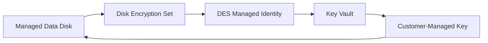

**Network exposure** is minimized in layers:

| Control                 | What it does                                                            | Why                                                |
| ----------------------- | ---------------------------------------------------------------------- | -------------------------------------------------- |
| **Azure Bastion**       | Brokers RDP/SSH to private IPs (Standard SKU + tunneling)              | Production path for interactive admin; Ansible instead uses the allowlisted public IP (next row) |
| **NSGs scoped to client IP** | Allow only RDP 3389 / WinRM 5985 / SQL 1433 from the operator's IP | Shrinks the attack surface to one address          |
| **LB listener rules**   | Allow `AzureLoadBalancer` + `VirtualNetwork` → 1433 / 59999           | Without them the probe is dropped and the listener silently fails |
| **`asg-win-<suffix>` ASG** | Groups all SQL VM NICs (Linux + Windows nodes) for internet-facing 1433 access | Allows peer SQL engine access over public IPs without per-IP rules |
| **`asg-sqlcluster` ASG** | Groups the two Windows node NICs for intra-cluster port rules | Lets five inbound NSG rules (SQL/HADR/heartbeat/RPC) apply to both nodes ASG-to-ASG; internet traffic cannot spoof ASG membership |

Key Vault also stores the CMK and the SSH key secrets. See
[key-vault.sh](../scripts/shell/test-env/key-vault.sh),
[bastion.sh](../scripts/shell/test-env/bastion.sh),
[network.sh](../scripts/shell/test-env/network.sh), and
[application-security-group.sh](../scripts/shell/test-env/application-security-group.sh).

---
## 🏛️ Active Directory Architecture
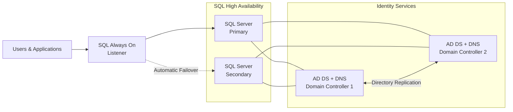


A dedicated Active Directory Domain Services (AD DS) and DNS server was introduced to provide the centralized identity, authentication, and name resolution required for Windows Server Failover Clustering (WSFC) and SQL Server Always On. This eliminates the limitations of workgroup-based deployments, enables secure Kerberos authentication and cluster identity management, and aligns the solution with Microsoft's recommended architecture for highly available SQL Server environments.


### Alternatives Considered

| Option                                                   |    Status    | Advantages                                                                                                                                                                                                                                                                                                                | Reason Not Selected / Trade-offs                                                                                                                                                                                        |
| -------------------------------------------------------- | :----------: | ------------------------------------------------------------------------------------------------------------------------------------------------------------------------------------------------------------------------------------------------------------------------------------------------------------------------- | ----------------------------------------------------------------------------------------------------------------------------------------------------------------------------------------------------------------------- |
| **Dedicated AD DS + DNS VMs**                            | ✅ **Chosen** | Fully supports Windows Server Failover Clustering (WSFC), SQL Server Always On, Kerberos authentication, Cluster Name Objects (CNOs), Virtual Computer Objects (VCOs), Group Policy, AD-integrated DNS, and future gMSA adoption. Provides full administrative control and high availability with two domain controllers. | Requires deployment, monitoring, patching, and ongoing management of domain controllers.                                                                                                                                |
| **Workgroup (No Active Directory)**                      |  ❌ Rejected  | Simple to deploy with no domain infrastructure required.                                                                                                                                                                                                                                                                  | Does not support Microsoft's recommended architecture for WSFC and SQL Server Always On. Lacks Kerberos authentication, centralized identity management, managed service accounts, and reliable cluster administration. |
| **Azure Active Directory Domain Services (Azure AD DS)** |  ❌ Rejected  | Fully managed directory service with reduced administrative overhead.                                                                                                                                                                                                                                                     | Does not provide the level of control and feature support required for WSFC and SQL Server Always On, including management of OUs, service accounts, and AD-integrated DNS required for the cluster environment.        |


### Decision

Two dedicated AD DS + DNS domain controllers are deployed for the SQL infrastructure, spanning two availability zones:

- **`dc-res-ind-112`** (zone 1) — the **forest root** of `sqlfci.local`, promoted by [configure-domain-controller.yml](../ansible/playbooks/configure-domain-controller.yml) (`microsoft.ad.domain`, new-forest path).
- **`dc2-res-ind-112`** (zone 2) — an **additional domain controller (replica)** in the same forest, joined and promoted by [configure-dc2.yml](../ansible/playbooks/configure-dc2.yml) (`microsoft.ad.membership` + `microsoft.ad.domain_controller`).

Both are Global Catalog servers, and directory changes replicate between them (see **Domain Controller Replication Verification** under Operational Validation for the live evidence).

---

## ⚙️ Active Directory Automation Strategy

This architecture separates the automation of Active Directory infrastructure from the administration of directory objects and policies. The following playbooks each have focused responsibilities.

> **Implementation Reference**
>
> **[View Ansible Playbooks](../ansible/playbooks/)**

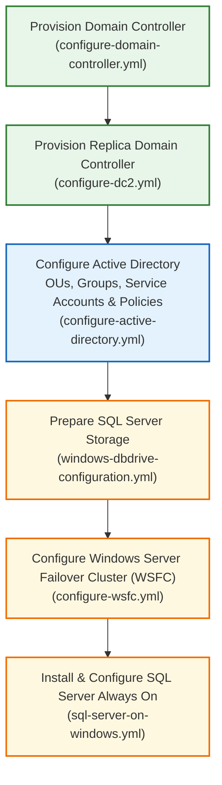


---

## 🗂️ Organizational Unit Design 

The AD DS hierarchy is structured for clarity and least privilege:

```
domain.local
├── Servers
│   └── [SQL Node 1, SQL Node 2]
├── Clusters
│   └── [WSFC CNO, SQL Listener VCO]
├── Service Accounts
│   └── [SQLSvc, WSFCAdmin, ...]
└── Groups
    └── [SQLAdmins, ClusterAdmins, ...]
```

**Purpose of each OU:**
- **Servers**: Domain-joined SQL Server VMs (computer objects).
- **Clusters**: Cluster Name Object (CNO) and Virtual Computer Objects (VCOs) for WSFC and SQL Listener.
- **Service Accounts**: Domain accounts for SQL Server, agent, and cluster services.
- **Groups**: Role-based AD groups for administration and service access.

---

## 🔄 Domain Join Strategy

**Deployment order:**
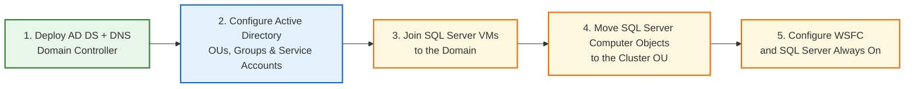
---

## 🏗️ Windows Server Failover Cluster Identity

WSFC and SQL Server Always On require special AD objects for secure operation:

- **Cluster Name Object (CNO):** The computer account representing the WSFC cluster. Created in the `Clusters` OU.
- **Virtual Computer Object (VCO):** The computer account representing the AG listener ("SQL Listener"). Created by the cluster under the CNO.

**Diagram:**

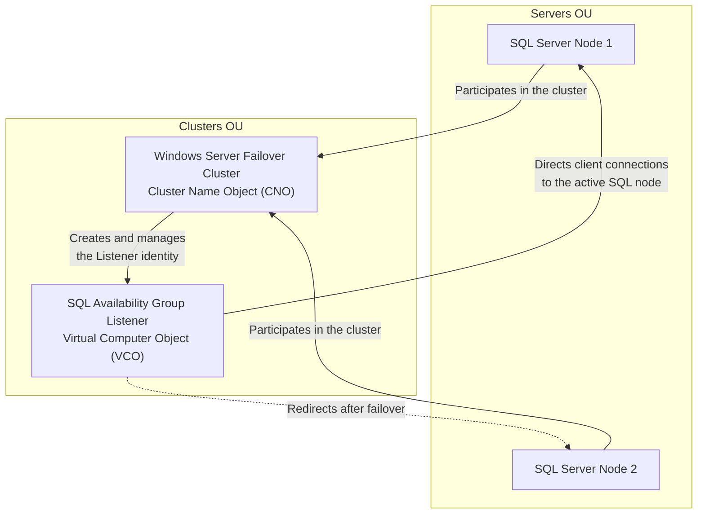

**OU Placement:**
- SQL node computer objects reside in the `Servers` OU for GPO and admin separation.
- CNO and VCO reside in the `Clusters` OU for delegated cluster permissions and isolation.

---

## 🚀 Deployment Pipeline

**End-to-end deployment flow:**

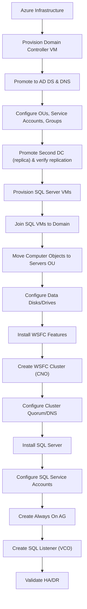

---

## 📘 Engineering Decisions and Lessons Learned

### DNS Client Restart vs DNS Cache Flush
**Problem:** After joining the domain and updating DNS, name resolution on SQL nodes was unreliable until reboot.
**Alternatives Considered:**  
- Restart DNS Client service  
- Flush DNS cache (`ipconfig /flushdns`)  
- Full reboot
**Decision:** Restarting the DNS Client service is usually sufficient and less disruptive than a full reboot.
**Why:** Ensures the node picks up new DNS settings and registrations immediately.

### Discovering AD DS Managed Disk
**Problem:** Identifying the correct disk to initialize and format for AD DS database and logs.
**Alternatives Considered:**  
- By disk number  
- By Azure LUN  
- By provisioned size (chosen)
**Decision:** Select disk by matching the provisioned size.
**Why:** Disk numbers and LUNs can vary depending on VM size and Azure deployment timing, but the size is unique and stable.

### Separating AD DS Promotion from AD Administration
**Problem:** Combining domain controller promotion with AD object administration risked idempotency and error recovery.
**Alternatives Considered:**  
- Single playbook for both roles  
- Separate playbooks (chosen)
**Decision:** Separate domain controller promotion (infrastructure) from management of OUs, accounts, and GPOs (administration).
**Why:** Reduces risk, improves reusability, and allows safe re-runs of administrative tasks.

### Moving Computer Objects Only After Domain Join
**Problem:** Computer objects do not exist until domain join completes, so cannot be moved or managed in OUs.
**Alternatives Considered:**  
- Pre-create computer objects  
- Move after join (chosen)
**Decision:** Move computer objects into target OUs only after successful domain join.
**Why:** Ensures correct object creation, avoids errors, and guarantees GPOs apply as intended.

---

## ✅ Operational Validation

The following table documents key validation commands and what each proves:

| Area           | Command / Check                                      | What it Proves                                                   |
|----------------|------------------------------------------------------|------------------------------------------------------------------|
| Active Directory | `Get-ADDomain`, `Get-ADUser`, `Get-ADComputer`     | Domain controller is functional, objects exist                    |
| AD Replication  | `repadmin /replsummary`, `Get-ADReplicationPartnerMetadata` | Both domain controllers replicate inbound and outbound with zero failures |
| DNS             | `nslookup <domain>`, `Resolve-DnsName <listener>`   | AD-integrated DNS is resolving cluster and listener names         |
| Domain Join     | `whoami`, `echo %USERDOMAIN%`, `nltest /dsgetdc:...` | Node is joined to domain, domain controller reachable             |
| Storage         | `Get-Volume`, `fsutil fsinfo volumeinfo F:`         | Data/log/backup drives are present, formatted, correct settings   |
| WSFC            | `Get-Cluster`, `Get-ClusterNode`, `Test-Cluster`    | Cluster is formed, nodes are up, CNO exists                      |
| SQL Server      | `sqlcmd -S <listener> -E -Q "SELECT @@SERVERNAME"`  | SQL is running, listener is reachable, Windows auth works         |
| Always On AG    | `Get-ClusterGroup`, `Get-SqlAvailabilityGroup`      | AG is created, synchronized, listener is online                   |

Each validation demonstrates the intended outcome for its layer:
- AD: Directory services are operational
- AD Replication: Directory changes converge across both domain controllers
- DNS: Cluster and SQL names resolve as expected
- Domain Join: Nodes are correctly authenticated and managed
- Storage: SQL disks are ready for use and follow best practices
- WSFC: Cluster is healthy and CNO/VCOs are present
- SQL: SQL Server is running and accessible through the cluster listener
- AG: Always On high availability is functional

### 🔁 Domain Controller Replication Verification

The two-domain-controller topology is stood up by two playbooks: [configure-domain-controller.yml](../ansible/playbooks/configure-domain-controller.yml) promotes `dc-res-ind-112` as the **forest root** of `sqlfci.local`, and [configure-dc2.yml](../ansible/playbooks/configure-dc2.yml) joins and promotes `dc2-res-ind-112` as an **additional domain controller (replica)** in the same forest. The captures below are the live evidence that both DCs are running, share one forest, and actively replicate directory data. Red annotations highlight the values a reviewer should check to confirm the result is genuine.

**1 — Both domain-controller VMs are running (Azure portal).** `dc-res-ind-112` and `dc2-res-ind-112` are both in the `Running` state in Central India.

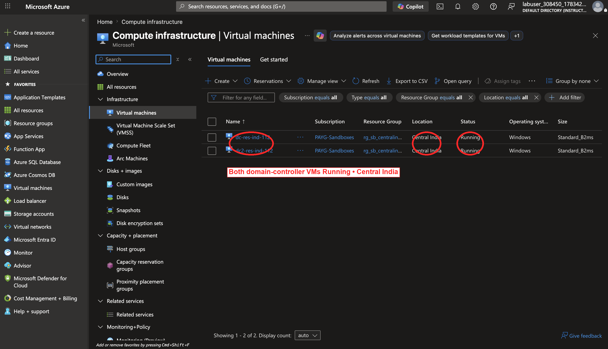

**2 — Both DCs are registered in one forest, and both are Global Catalogs.** `Get-ADDomainController` lists both hosts with their static private IPs (`10.10.4.4`, `10.10.4.5`); `Get-ADforest` shows a single domain `sqlfci.local` with both servers as Global Catalogs; `Get-ADReplicationPartnerMetadata` shows a recent `LastReplicationSuccess`.

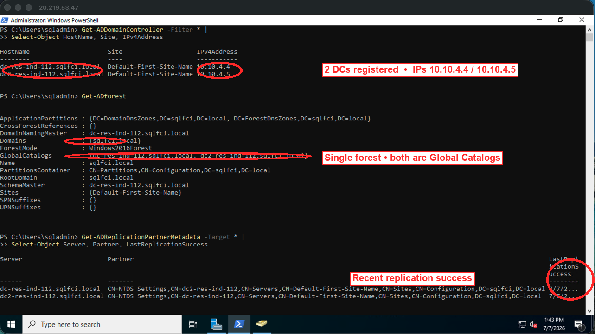

**3 — Replication is healthy in both directions.** `repadmin /replsummary` reports `0` failures for every source and destination DSA — no replication errors between `dc-res-ind-112` and `dc2-res-ind-112`, inbound or outbound.

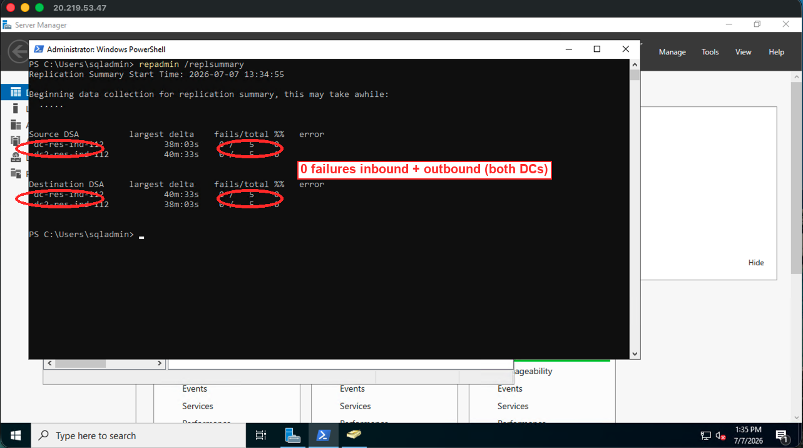

**4 — A test object is created on DC1.** A `Test Replication` user (`test.replication@sqlfci.local`) is created on `dc-res-ind-112` (RDP host `20.219.53.47`) and appears in the `sqlfci.local/Users` container in Active Directory Users and Computers.

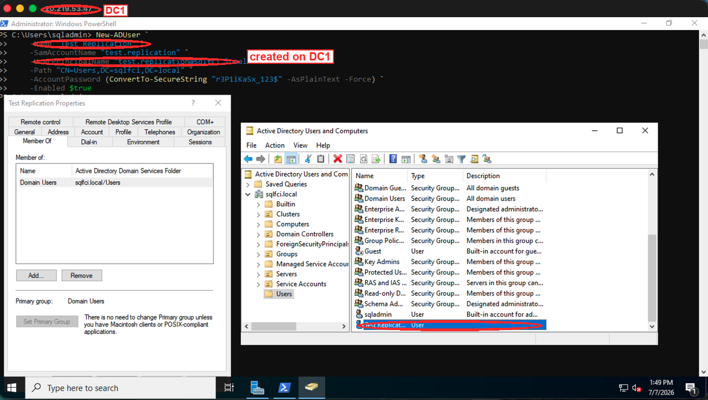

**5 — The same object is visible on DC2.** Running `Get-ADUser test.replication` on `dc2-res-ind-112` (RDP host `20.219.145.108`) returns the identical object — same distinguished name and UPN — proving the create on DC1 replicated to DC2. The `hostname` output confirms the query ran on the second DC.

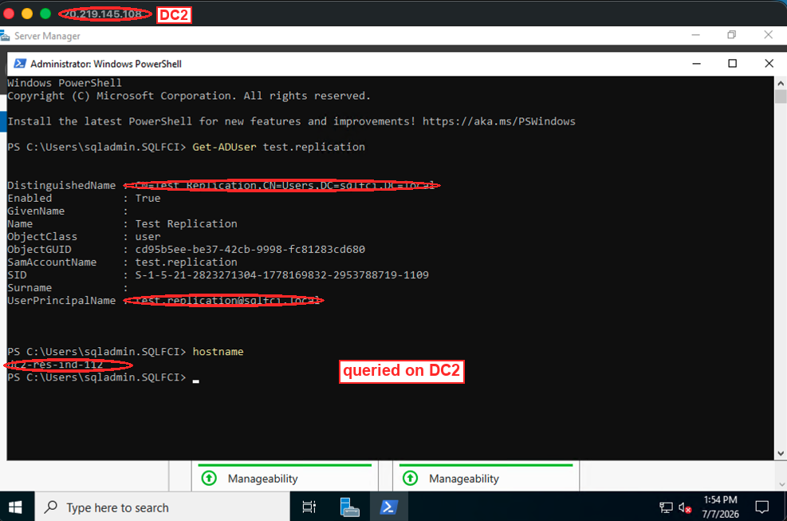

Together these confirm the intended outcome of this layer: a redundant, actively replicating two-DC forest that WSFC and SQL Server Always On can depend on for Kerberos authentication and AD-integrated DNS.

---

