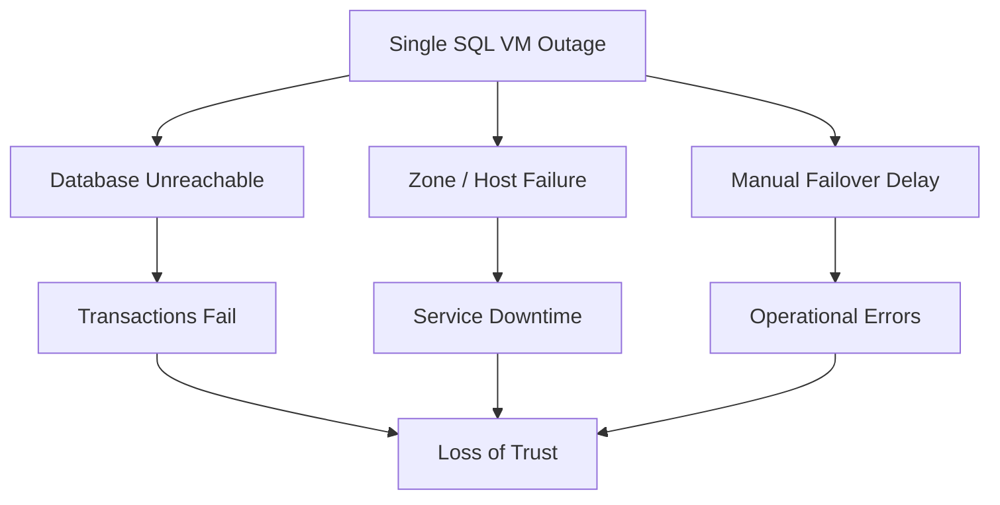
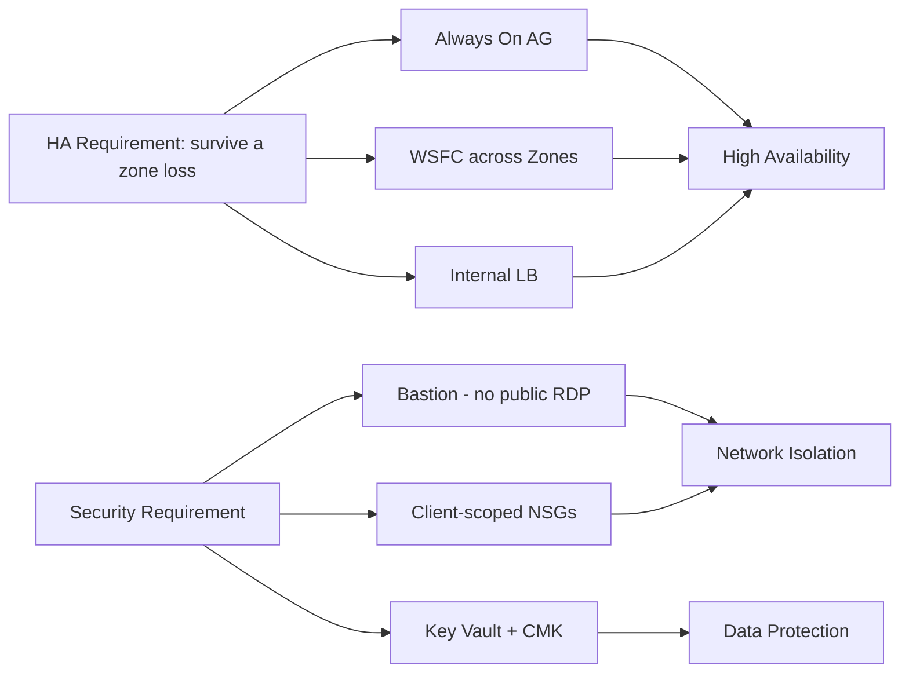
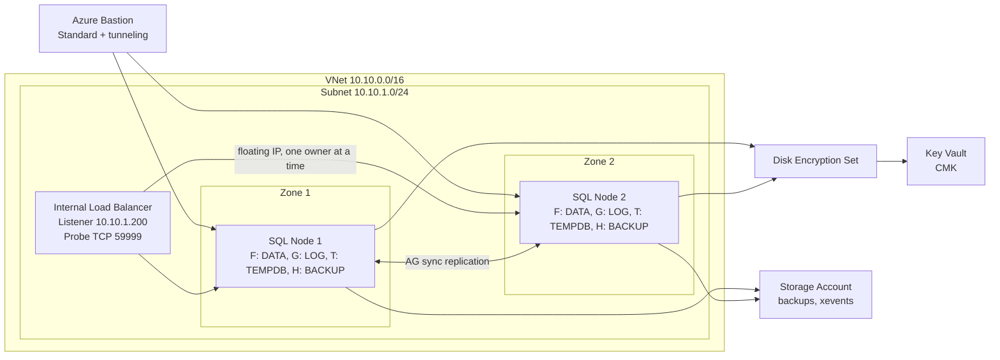
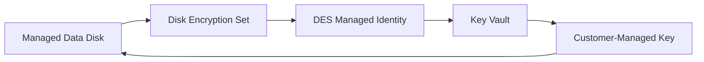
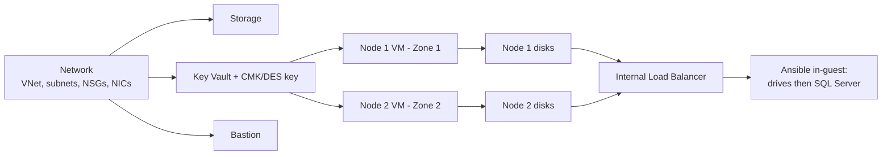

# Secure, Zone-Redundant SQL Server on Azure VMs (IaaS) with Always On Availability Groups

This document describes the **IaaS** track of the platform: SQL Server 2022 running on
**Windows Server VMs** made highly available with **Always On Availability Groups (AGs)**
across **two availability zones**, fronted by an internal load balancer listener, secured
with private access and customer-managed encryption.

It is the sibling of the managed-database design in
[paas-database.md](paas-database.md). Where the PaaS doc delivers HA/DR through
Azure SQL Database *Failover Groups*, this doc delivers it by running the database engine
ourselves on VMs — trading managed convenience for full control of the OS, the SQL
instance, and the clustering layer.

---

## 🔴 Problem Overview

Running SQL Server yourself on VMs reintroduces every responsibility the PaaS service used
to hide. A naive "one SQL VM, public RDP, manual recovery" deployment carries three
classes of risk:

| Risk                | Description                                  | Business Impact                  |
| ------------------- | -------------------------------------------- | -------------------------------- |
| Single point of failure | One VM / one zone — host or zone outage stops the database | Transactions stop |
| Exposure            | Public RDP/SQL ports, plaintext disks        | Large attack surface, data theft |
| Operational failure | Manual failover and disk setup               | Slow, error-prone recovery       |

---

## 🎯 Engineering Objective

Build a secure, highly available SQL Server platform on VMs that survives a zone failure,
and protects data at rest — while staying
deployable inside an identity-restricted sandbox.

| Problem                       | Solution                              | Azure / SQL Feature                         |
| ----------------------------- | ------------------------------------- | ------------------------------------------- |
| Node / zone outage            | Synchronous replicas across zones     | **Always On AG** + **WSFC**, Zone 1 / Zone 2 |
| Slow client reconnect on failover | Single floating listener endpoint  | **Internal Load Balancer** (floating IP + health probe) |
| Public exposure               | Attack surface reduced to an allowlisted `/32` (not eliminated) | **Azure Bastion** for interactive admin + allowlisted public **WinRM/SSH** for Ansible, NSG-scoped to the operator IP |
| Data at rest                  | Customer-controlled disk encryption   | **Key Vault CMK** + **Disk Encryption Set (SSE)** |
| Identity (no domain)          | Cluster trust without Active Directory | **Local accounts + certificate HADR endpoints** |

---

## 🧭 Why an IaaS Track Alongside PaaS

The PaaS database already meets the HA/DR goals with less operational burden. The VM track
exists for the cases PaaS cannot cover:

| Driver                     | Why it needs IaaS                                                        |
| -------------------------- | ----------------------------------------------------------------------- |
| Full OS + instance control | Agent installs, trace flags, file placement, instance-level configuration |
| Always On AG demonstration | Show WSFC, synchronous replicas, listener failover end-to-end           |
| No-Active-Directory lab     | Prove a **workgroup cluster** with certificate-based trust (no domain)   |

---

## 🏗️ System Architecture

Both SQL nodes share one subnet but sit in **different availability zones**. The internal
load balancer publishes the AG listener's floating IP; Bastion brokers private admin
access; Key Vault holds the CMK that the Disk Encryption Set wraps every data disk with.

---

## 🌍 Region & Availability-Zone Strategy

| Role            | Placement                |
| --------------- | ------------------------ |
| Region          | Central India (single)   |
| SQL Node 1      | Availability **Zone 1**  |
| SQL Node 2      | Availability **Zone 2**  |

HA here is **intra-region, cross-zone**: a zone failure takes at most one replica. (The
PaaS track adds *cross-region* DR via Failover Groups; the VM track demonstrates zonal HA.)

**Trade-off — disk redundancy:**

| Option                                  | Impact                                                              |
| --------------------------------------- | ------------------------------------------------------------------ |
| Zonal **LRS** disks pinned to the VM zone (chosen) | A managed disk must live in the same zone as its VM; cross-zone durability comes from **AG replication**, not the disk |
| **ZRS** disks                            | Zone-redundant at the storage layer, but the AG already replicates data, so LRS-per-zone is sufficient and cheaper here |

---

## 🔌 Single-Subnet + Internal-Load-Balancer Listener Decision

Both replicas live in **one subnet** (`10.10.1.0/24`). A single-subnet AG cannot advertise
a multi-subnet VNN listener, so the listener IP is published by an **internal load
balancer** using a *floating IP* (direct server return): only the replica that currently
owns the AG answers on `10.10.1.200:1433`, and a **TCP health probe on 59999** tells the LB
which node that is.

| Connectivity model            | Mechanism                                  | Suitability here                         |
| ----------------------------- | ------------------------------------------ | ---------------------------------------- |
| Internal LB + floating IP ✅  | Probe-driven failover within one subnet     | ✅ Required for a single-subnet AG        |
| Multi-subnet VNN listener     | DNS registers all replica IPs              | ❌ Needs replicas in separate subnets     |
| **DNN** listener (SQL 2019 CU8+) | DNS-based, no LB at all                   | ⚠️ Modern alternative; removes the LB/probe entirely |

The load balancer is **Standard, internal, regional**, with a zone-redundant frontend so
it survives a zone loss. Two NSG rules (sourced from the `AzureLoadBalancer` and
`VirtualNetwork` service tags to ports `1433` + `59999`) are **resolved against whichever
NSG is actually attached to each node's NIC**, so the listener keeps working even if the
NSG wiring drifts. See [load-balancer.sh](../scripts/shell/test-env/load-balancer.sh).

---

## 🖥️ Compute Layer

| Aspect           | Value                                              | Why                                                                 |
| ---------------- | ------------------------------------------------- | ------------------------------------------------------------------- |
| Image            | Windows Server 2022 Datacenter (Azure Edition)    | Base OS with no Marketplace plan/terms to accept                    |
| SQL Server       | 2022 **Developer**, downloaded + installed in-guest | Free, full-featured for a lab; avoids Marketplace image licensing   |
| VM size          | `Standard_B2ms` (2 vCPU / 4 GB)                   | Modest, sandbox-sized; raise for real workloads                     |
| Identity         | System-assigned **managed identity**              | Lets the VM authenticate to Key Vault without stored secrets        |
| Remote mgmt      | **WinRM** HTTP/5985 (NTLM)                         | How Ansible configures Windows; NSG limits it to the client IP      |

> **Sandbox vs production:** WinRM here is HTTP (5985) for fast iteration. Production should
> use the HTTPS listener (5986) with a real certificate. SQL Developer edition is not
> licensed for production use.

See [win-sql-vm.sh](../scripts/shell/test-env/win-sql-vm.sh) (Node 1) and
`win-sql-vm-2.sh` (Node 2).

---

## 💾 Storage Layer — Encrypted Data Disks

Each node gets four dedicated, CMK-encrypted data disks, formatted **NTFS with a 64 KB
allocation unit** (the SQL Server I/O best practice) and laid out for I/O isolation:

| LUN | Drive | Label     | Size (GB) | Purpose                | Host caching | Why this caching             |
| --- | ----- | --------- | --------- | ---------------------- | ------------ | ---------------------------- |
| 0   | F:    | SQLDATA   | 4022      | Data files             | ReadOnly     | Read-heavy; cache speeds reads |
| 1   | G:    | SQLLOG    | 2011      | Transaction log        | None         | Log writes must be durable    |
| 2   | T:    | SQLTEMPDB | 1024      | tempdb                 | ReadOnly     | Scratch; read cache is safe   |
| 3   | H:    | SQLBACKUP | 8124      | Backups                | None         | Sequential writes; no caching |

- **Zonal pinning:** a managed disk must be in the same zone as its VM, so Node 1's disks
  are created in Zone 1 and Node 2's in Zone 2.
- **Order:** Windows attaches disks to an existing VM, so the pattern is *VM first, then
  disks* (the reverse of the Linux track).
- **Self-healing in-guest config:** the disk playbook detects "needs formatting" at the
  **volume** level (no NTFS filesystem), not just the disk level. This recovers a disk that
  a previous interrupted run left *partitioned but unformatted* (the classic
  "inaccessible Local Disk with no capacity bar") without any manual clicking — see
  [windows-dbdrive-configuration.yml](../ansible/playbooks/windows-dbdrive-configuration.yml).

See [win-encrypted-disks.sh](../scripts/shell/test-env/win-encrypted-disks.sh) /
`win-encrypted-disks-2.sh`.

---

## 🔐 Security & Encryption

**Encryption at rest** uses Server-Side Encryption with a Customer-Managed Key. Every data
disk is wrapped by a **Disk Encryption Set (DES)** whose system identity is granted
`wrap`/`unwrap` on a Key Vault key — so the customer controls the key lifecycle:

**Network exposure** is minimized in layers:

| Control                 | What it does                                                            | Why                                                |
| ----------------------- | ---------------------------------------------------------------------- | -------------------------------------------------- |
| **Azure Bastion**       | Brokers RDP/SSH to private IPs (Standard SKU + tunneling)              | Production path for interactive admin; Ansible instead uses the allowlisted public IP (next row) |
| **NSGs scoped to client IP** | Allow only RDP 3389 / WinRM 5985 / SQL 1433 from the operator's IP | Shrinks the attack surface to one address          |
| **LB listener rules**   | Allow `AzureLoadBalancer` + `VirtualNetwork` → 1433 / 59999           | Without them the probe is dropped and the listener silently fails |
| **Application Security Group** | Groups both node NICs under one logical handle                  | *Created but not yet wired* — lets future NSG rules target the group instead of per-NIC entries |

Key Vault also stores the CMK and the SSH key secrets. See
[key-vault.sh](../scripts/shell/test-env/key-vault.sh),
[bastion.sh](../scripts/shell/test-env/bastion.sh),
[network.sh](../scripts/shell/test-env/network.sh), and
[application-security-group.sh](../scripts/shell/test-env/application-security-group.sh).

---

## 🧩 HADR Strategy in a No-AD Lab

A **Windows Server Failover Cluster (WSFC)** is the foundation Always On Availability Groups run
on — it provides **automatic failover**, the **AG listener resource**, and **cluster health
monitoring**. A WSFC runs in one of two modes: **domain-joined** (backed by Active Directory) or
**workgroup** (no domain, supported since Windows Server 2016).

With no Active Directory in the sandbox, the chosen direction is a **workgroup cluster** with
**certificate-based authentication** on the SQL HADR endpoints. Local accounts plus certificates
establish the inter-node trust a domain would otherwise provide via Kerberos — the cluster
foundation is the same, only its identity model differs.

**Why Entra ID doesn't substitute for a domain.** A domain-based cluster would require joining every
node to **Active Directory Domain Services (AD DS)** and running the SQL service + HADR endpoints
under **domain accounts or gMSAs**, so the nodes authenticate via Kerberos. **Entra ID is not a
Windows domain** — you cannot domain-join a VM to an Entra tenant and obtain the AD DS
computer-account/Kerberos semantics a cluster needs, and an Entra **object ID is not a Windows
service account**. The managed bridge that *would* provide this (**Microsoft Entra Domain Services**)
is a separate, paid service. As a **restricted user** in the Whizlabs tenant, none of these are
available — no AD DS to join, no rights to provision one, no domain/gMSA accounts to assign — which
is precisely why cluster trust is established with **certificates**.

**Automation boundary (important):** everything *around* the cluster is automated — VMs, encrypted
disks, drives, SQL Server install, the load balancer, and the listener NSG rules. The **cluster
build, the AG creation, the certificate HADR endpoints, the listener binding (to `10.10.1.200` /
probe `59999`), and replica synchronization are performed in-guest** (Failover Cluster Manager /
SSMS / PowerShell on the primary). This document describes the architecture and the *why*; it
intentionally does not include a step-by-step cluster runbook.

---

## ⚙️ Automation Workflow & Orchestration

[db-deploy.sh](../scripts/shell/test-env/db-deploy.sh) is the orchestrator: it calls the
per-feature scripts in dependency order. The two rules that drive the ordering:

1. **Networking comes first** — storage and Key Vault attach network rules bound to the
   subnet, and the VMs need the NICs the network step creates.
2. **Windows = VM then disks** — disks attach to an existing VM (the reverse of Linux).

In-guest, Ansible runs the **drive configuration first**, then the **SQL Server install**,
so the engine's data/log/tempdb/backup directories land on the prepared F/G/T/H disks.
The next two sections drill into exactly what each in-guest play does and why.

---

## 🪛 Stage 1 — In-Guest Drive Configuration

The first play turns the raw encrypted disks into SQL-ready NTFS drives, then creates the
`F:\SQLDATA`, `G:\SQLLOG`, `T:\TEMPDB`, `H:\SQLBACKUP` folders Stage 2 depends on. See
[windows-dbdrive-configuration.yml](../ansible/playbooks/windows-dbdrive-configuration.yml).

The parts worth highlighting:

- **Disks are discovered, never hard-coded.** A probe maps each Azure LUN to its (unstable) Windows
  disk number at runtime — so the play stays portable and survives re-runs.
- **64 KB NTFS allocation unit** — matches SQL Server's 64 KB extent: the canonical data/log I/O
  best practice.
- **One dedicated disk per role** (data / log / tempdb / backup) — physical I/O isolation, and each
  role keeps its own disk SKU and cache setting.
- **Idempotent and self-healing** — readiness is tracked at the *volume* level, so a disk left
  half-done by an interrupted run (partitioned but unformatted) repairs itself, and existing data is
  never reformatted.

---

## 🗄️ Stage 2 — In-Guest SQL Server Build

The second play installs **SQL Server 2022 Developer + SSMS** and hardens the instance. It is
server-level only and creates no database (the schema and workloads arrive later via the .NET/SQL
scripts). See [sql-server-on-windows.yml](../ansible/playbooks/sql-server-on-windows.yml).

The parts worth highlighting:

- **Storage layout baked into the install.** The unattended-install switches put system DBs off
  `C:`, user data on `F:`, logs on `G:`, tempdb on `T:`, and backups on `H:` — Stage 1's drives
  become the engine's file placement.
- **DBA hardening at install time** — Instant File Initialization, `MAXDOP = min(8, CPUs)`, cost
  threshold for parallelism `50`, and fixed **256 MB** autogrowth (never percent).
- **Idempotent and self-healing** — it validates the install media isn't corrupt (re-downloading if
  so), skips the install when the engine already exists, and **restarts SQL only when something
  actually changed**.
- **Cross-node identity** (ties into [HADR Strategy](#-hadr-strategy-in-a-no-ad-lab)) — the engine
  runs as a machine-local account: fine standalone, but it can't authenticate to another node, which
  is exactly *why* the Always On AG layer uses **certificate-based HADR endpoints**.

---

## 🧱 Automation Boundary

| Automated (Bash + `az` CLI / Ansible)                          | Manual (in-guest)                              |
| -------------------------------------------------------------- | ---------------------------------------------- |
| VNet, subnets, NSGs, NICs, public IPs                          | Build the **workgroup WSFC**                    |
| Key Vault, CMK, Disk Encryption Set                            | Create the **Availability Group** + replicas    |
| VM creation (both zones), managed identity, WinRM              | Configure **certificate-based HADR endpoints**  |
| Encrypted disks: create, zonal-pin, attach                     | Bind the **AG listener** to `10.10.1.200`/59999 |
| Drive init/partition/format (64 KB NTFS), SQL Server install   | Seed / synchronize **replica databases**        |
| Internal LB: frontend, backend pool, probe, floating-IP rule, listener NSG rules | Quorum / witness configuration |

---

## 🔌 Configuration-Management Connectivity — Ansible over Public IP vs. VPN + In-VNet Control Node

The database **data plane** is private: the engine runs on the VMs and is published through an
**internal load balancer** listener (`10.10.1.200`) — there is no public SQL endpoint. The open
question is the **management plane**: how does Ansible reach the VMs to configure drives, install
SQL Server, and harden the instance?

**Context** — In production, the SQL VMs would carry **no public IP**. Operators would reach them
only through **Azure Bastion** (private RDP/SSH), and configuration management would run from an
**Ansible control node *inside* the VNet** (a jump host or self-hosted runner) that targets the
nodes by their **private IPs** — with operator/CI reachability into the VNet provided by a
**VPN gateway or ExpressRoute**.

**Decision** — In the time-boxed sandbox, the VMs keep **allowlisted public IPs** and Ansible runs
**over the public internet** via WinRM (5985/NTLM), with the NSG scoping 3389 / 5985 / 1433 to the
operator's `/32`. No VPN gateway and no in-VNet control node are deployed.

**Rationale** — A VPN gateway plus an in-VNet runner adds real deploy/teardown time and cost on
every ephemeral sandbox cycle, with no change to the *configuration outcome* — drives formatted,
SQL installed, instance hardened. The allowlisted public management IP reaches that same end state
in minutes. Getting reproducible results was preferred over reproducing the full production network
topology.

**Alternatives considered**

| Option                                                                 | Why not (here)                                                                                |
| ---------------------------------------------------------------------- | --------------------------------------------------------------------------------------------- |
| **VPN/ExpressRoute + in-VNet Ansible control node** (production-ideal) | Gateway + runner are slow and costly to stand up and tear down each sandbox cycle             |
| **Ansible through a Bastion tunnel** (`az network bastion tunnel`)     | Bastion Standard + tunneling *is* deployed, so this was possible — but WinRM/NTLM over a tunnel is fiddly, so it was skipped for speed |
| **Run Command / VM extensions / Azure Arc** (control-plane push)       | Workable against a private VM with no inbound path, but a larger rework than the WinRM flow already in place |

**Not a Private Link limitation (important).** This is a **cost/time** trade-off, not something the
architecture forced. A **Private Endpoint secures a PaaS service** (as on the sibling
[PaaS track](paas-database.md)) — **a VM never has a private endpoint** — and a VM's allowlisted
**public *management* IP is independent of how its *data* plane is secured** (here, the internal-LB
listener). The two planes do not conflict.

**Consequences** — Faster, reproducible automation, at the cost of a **publicly exposed (allowlisted)
management plane** rather than a fully private one. **Hardening path:** drop the VM public IPs and
run Ansible from an in-VNet control node reached over **Bastion tunneling or VPN/ExpressRoute** — at
which point the management plane is as private as the data plane already is.

---

## 🧰 Sandbox Constraints & Trade-offs

Built and tested in the Whizlabs Azure sandbox: **temporary, identity-restricted, time-limited.**

| Constraint                                       | Consequence                                                    |
| ------------------------------------------------ | ------------------------------------------------------------- |
| No Active Directory / domain                      | Workgroup cluster + certificate HADR instead of domain WSFC   |
| No RBAC to other identities, no OIDC, no service principal | No CI/CD infra deploy — use local `az login` + Bash      |
| Identity-restricted automation                    | VM config via Ansible (WinRM), SQL config via PowerShell      |
| Cost / time bounded                               | `Standard_B2ms`, SQL **Developer** edition, **LRS** disks, HTTP WinRM |

| Purpose                    | Approach used            |
| -------------------------- | ------------------------ |
| Infrastructure deployment  | Local Bash orchestration |
| Azure authentication       | Local `az login` session |
| VM configuration           | Ansible (WinRM/NTLM)     |
| SQL configuration          | PowerShell               |

> **Screenshots:** captures of the deployed AG / Failover Cluster Manager / encrypted disks
> can be added under `docs/images/` and embedded here (TBD).

---

## 📁 Component & File Reference

| Concern                  | Script / Playbook                                                                 |
| ------------------------ | -------------------------------------------------------------------------------- |
| Orchestration            | [db-deploy.sh](../scripts/shell/test-env/db-deploy.sh)                            |
| Shared config / names    | [env.conf](../scripts/shell/test-env/env.conf)                                    |
| Networking + NSGs        | [network.sh](../scripts/shell/test-env/network.sh)                                |
| Bastion                  | [bastion.sh](../scripts/shell/test-env/bastion.sh)                                |
| Key Vault + CMK/DES key  | [key-vault.sh](../scripts/shell/test-env/key-vault.sh)                            |
| SQL Node 1 / Node 2 VMs  | [win-sql-vm.sh](../scripts/shell/test-env/win-sql-vm.sh) · `win-sql-vm-2.sh`      |
| Encrypted disks          | [win-encrypted-disks.sh](../scripts/shell/test-env/win-encrypted-disks.sh) · `win-encrypted-disks-2.sh` |
| Internal LB (AG listener)| [load-balancer.sh](../scripts/shell/test-env/load-balancer.sh)                    |
| Application Security Group| [application-security-group.sh](../scripts/shell/test-env/application-security-group.sh) |
| Drive config (in-guest)  | [windows-dbdrive-configuration.yml](../ansible/playbooks/windows-dbdrive-configuration.yml) |
| SQL install (in-guest)   | `ansible/playbooks/sql-server-on-windows.yml`                                     |
| Ansible connectivity     | [inventory.ini](../inventory.ini) · `ansible.cfg`                                 |
| Sibling PaaS design      | [paas-database.md](paas-database.md)                                              |
